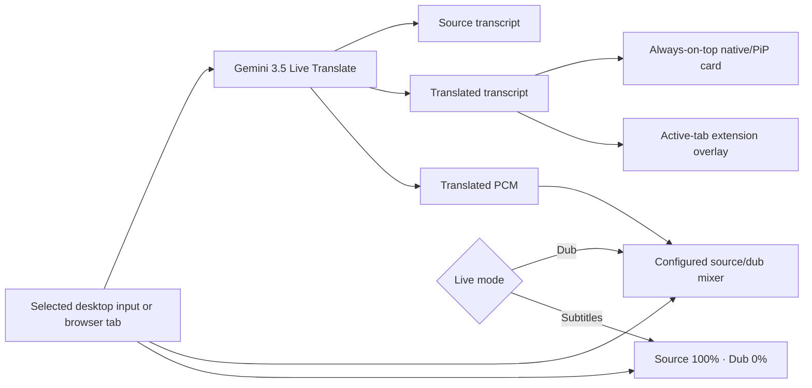
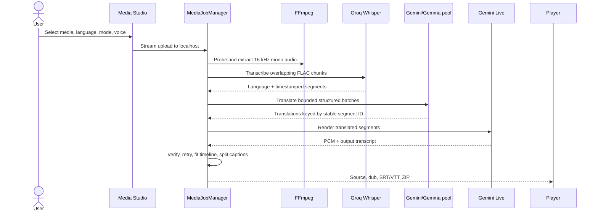

# Architecture

Lingora contains two independent products: a cross-platform desktop application and a Manifest V3 browser extension. Neither requires the other.

## Product boundaries

| Product | Input | AI path | Credentials | Outputs |
|---|---|---|---|---|
| Desktop live | selected loopback/monitor input | Gemini 3.5 Live Translate | Gemini key in the OS keyring | playback, floating captions, WAV/SRT/ZIP |
| Media Studio | local audio/video + FFmpeg | Groq Whisper → Gemini text pool → Gemini Live speech | Groq + Gemini keys in the OS keyring | synchronized player, four files, ZIP |
| Browser extension | explicit `chrome.tabCapture` session | direct Gemini Live WebSocket | session-only `chrome.storage.session` | playback, page overlay, optional four Downloads |

The desktop UI is served only on `127.0.0.1:8765`. pywebview hosts that same UI natively on Windows (WebView2), macOS (WKWebView), and Linux (Qt WebEngine). The browser fallback remains available with `lingora --browser`.

## Desktop modules

| Module | Responsibility |
|---|---|
| `ConfigStore` | atomic settings, OS-keyring secrets, legacy migration, proxy environment |
| `AudioEngine` | Windows WASAPI loopback or cross-platform PortAudio capture/output; PCM conversion and mixing |
| `GeminiGateway` | continuous Gemini 3.5 Live Translate protocol and reconnects |
| `GeminiFileGateway` | strongest-first free-tier translation pool and exact-text Live narration |
| `GroqWhisperGateway` | timestamped transcription, bounded multipart requests, retries |
| `DubRuntime` | live lifecycle, transcripts, subtitle-only source/dub policy, recording |
| `MediaJobManager` | upload queue, recovery, cancellation, quotas, pipeline orchestration |
| `MediaTools` | FFprobe, extraction, FLAC chunks, time fitting, archives |
| `TokenGovernor` | conservative rolling Gemini reservations |
| FastAPI | loopback-only dashboard API and allowlisted local files |

`src/lingora` is the public entry point. The implementation remains under `src/dubira` for one compatibility cycle so existing installations and third-party imports do not break during the public rename.

## Live subtitle flow

The desktop subtitle window polls the local state endpoint and never receives credentials. Native builds use a hidden, frameless, resizable, always-on-top pywebview window. Browser mode prefers Document Picture-in-Picture and falls back to a popup. The extension injects one idempotent Shadow DOM overlay only after an explicit action on the selected tab. `activeTab` + `scripting` avoids persistent `<all_urls>` access.

## Uploaded-media sequence

The source file never leaves localhost. Only extracted audio chunks go to Groq; Gemini receives transcript text for translation and translated text for narration. Media manifests are atomic, cancellation propagates to waits and subprocesses, and one worker processes one file at a time.

## Platform audio

- Windows enumerates WASAPI loopback devices with PyAudioWPatch.
- macOS and Linux enumerate input/output devices through sounddevice/PortAudio.
- macOS requires an explicit loopback input such as BlackHole for system audio.
- Linux requires the relevant PipeWire/PulseAudio monitor source.
- Uploaded media and the browser extension do not need virtual routing.

## Security and quotas

- Local service binds only to `127.0.0.1`.
- Job IDs and downloadable filenames are allowlisted.
- Gemini and Groq secrets are never serialized into settings, state, or job manifests.
- Gemini file processing reserves no more than 15,000 estimated tokens per rolling 60 seconds.
- Extension source injection is temporary, user-initiated, and limited to the active tab.
- The extension has no localhost permission, arbitrary-site host permission, remote executable code, analytics, or advertising.

No JavaScript framework, bundler, database, task broker, or cloud storage is required.
