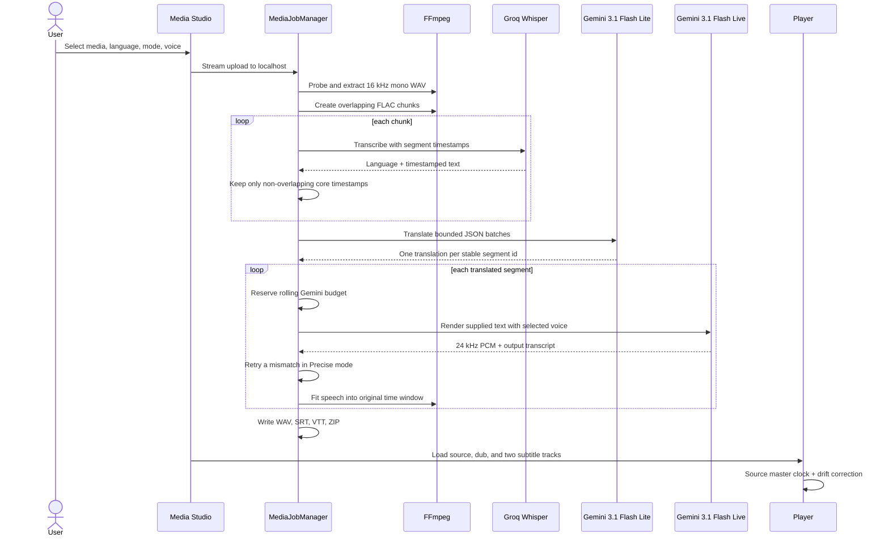

# Architecture

Voxilyra contains two independent products. The Windows app handles desktop audio and uploaded files; the Manifest V3 extension handles browser-tab audio. Neither product depends on the other.

## Product boundaries

| Product | Input | AI path | Credentials | Outputs |
|---|---|---|---|---|
| Windows live app | WASAPI loopback | Gemini 3.5 Live Translate | Gemini key in Windows Credential Manager | playback + WAV/SRT/ZIP |
| Windows Media Studio | local audio/video + FFmpeg | Groq Whisper → Gemini text → Gemini Live speech | separate Groq and Gemini keys in Credential Manager | player + four files + ZIP |
| Browser extension | `chrome.tabCapture` + AudioWorklet | direct Gemini Live WebSocket | `chrome.storage.session` | playback + four Downloads files |

## Desktop modules

| Module | Responsibility |
|---|---|
| `ConfigStore` | settings, separate keyring secrets, legacy Gemini-key fallback, proxy environment |
| `AudioEngine` | WASAPI capture, PCM conversion, mixed playback |
| `GeminiGateway` | continuous Gemini 3.5 Live Translate protocol |
| `GeminiFileGateway` | structured text translation and exact-text Gemini Live narration |
| `GroqWhisperGateway` | authenticated Whisper multipart requests, retries, response errors |
| `DubRuntime` | desktop live lifecycle and reconnects |
| `MediaJobManager` | upload queue, recovery, cancellation, quota, and file-pipeline orchestration |
| `MediaTools` | FFprobe, extraction, Groq-safe FLAC chunks, time fitting, archive |
| `TokenGovernor` | conservative 60-second Gemini reservations |
| FastAPI app | local dashboard and allowlisted files |

Media manifests are atomically persisted. One worker processes one file at a time. Cancellation propagates into network waits and exact FFmpeg subprocesses.

## Uploaded-media sequence

The source file never leaves localhost. Audio chunks are the only uploaded-media bytes sent to Groq. Gemini receives transcript text for translation and translated text for narration. `whisper-large-v3` is the default accuracy model; Fast mode uses `whisper-large-v3-turbo`. Structured translation preserves segment IDs and rejects missing results.

## Standalone extension

The extension continues to use `gemini-3.5-live-translate-preview` because that model natively translates live speech. `chrome.tabCapture` replaces direct tab playback, so the offscreen document recreates exactly the original/dub mix selected by the user. Its long-lived Gemini key is session-only; a public Store deployment should replace it with an authenticated ephemeral-token service.

## Security and quotas

- The app binds only to `127.0.0.1:8765`.
- Job IDs and downloadable filenames are allowlisted.
- Gemini and Groq secrets are never serialized into settings or job manifests.
- The default Gemini governor reserves no more than 15,000 estimated tokens per rolling 60 seconds.
- Groq requests are sequential, use sub-25 MB FLAC chunks, honor `Retry-After`, and retry only 429/5xx failures.
- The extension has no localhost permission, content script, remote executable code, or arbitrary-site host access.

No JavaScript framework, bundler, database, task broker, or cloud storage is required.
