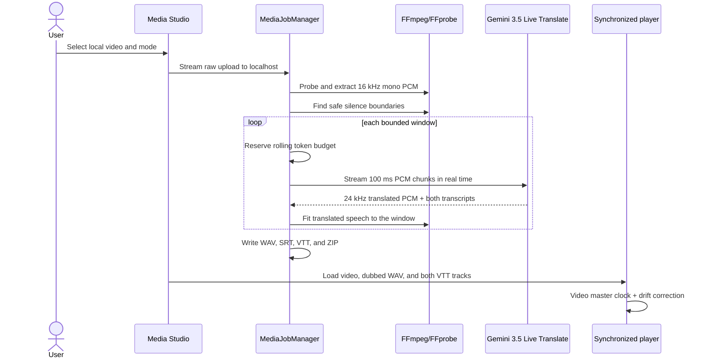
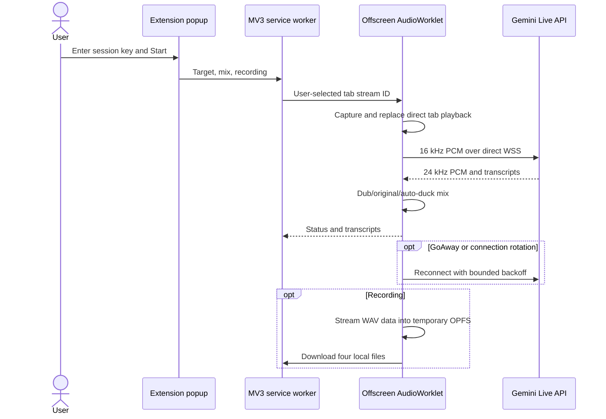

# Architecture

LingoDub contains two independent products. The Windows app handles desktop audio and uploaded files; the Manifest V3 extension handles browser-tab audio. Neither product starts, configures, authenticates, or transports audio for the other.

## Product boundaries

| Product | Capture/input | Gemini connection | Credentials | Outputs |
|---|---|---|---|---|
| Windows live app | WASAPI loopback | Python `google-genai` Live API | Windows Credential Manager or private `.env` | playback + WAV/SRT/ZIP |
| Windows Media Studio | local file → FFmpeg PCM | sequential real-time Live sessions | same desktop key | video player + four files + ZIP |
| Browser extension | `chrome.tabCapture` + AudioWorklet | direct Gemini Live WebSocket | `chrome.storage.session` | playback + four Downloads files |

Every path uses only `gemini-3.5-live-translate-preview`. There is no secondary TTS, STT, Files, Batch, or Generate Content model.

## Desktop modules

| Module | Owns | Does not own |
|---|---|---|
| `ConfigStore` | desktop settings, keyring, `.env`, proxy environment | HTTP or Gemini calls |
| `AudioEngine` | WASAPI capture, PCM conversion, mixed playback | translation policy |
| `GeminiGateway` | Google SDK and Live Translate protocol | devices, persistence, UI |
| `DubRuntime` | live session lifecycle and reconnection | browser APIs |
| `MediaJobManager` | uploads, queue, recovery, cancellation, orchestration | FFmpeg process details |
| `MediaTools` | probe, extraction, silence cuts, time fitting, archive | Gemini or job policy |
| `TokenGovernor` | rolling 60-second local reservations | Google account quotas |
| `SessionRecorder` | desktop WAV/SRT/ZIP output | playback or translation |
| FastAPI app | local dashboard, safe files, HTTP range | extension traffic |

Media-job manifests are atomically persisted. Active jobs recover as queued after a restart. One worker processes one real-time stream at a time, and cancellation propagates into network waits and FFmpeg subprocesses.

## Uploaded-video sequence

The uploaded video never leaves localhost. Only extracted PCM goes to Google. The default local governor is 15,000 estimated tokens per rolling minute, below the 20,000 requested ceiling.

## Standalone extension sequence

## Security boundaries

- The app binds only to `127.0.0.1:8765`; no extension endpoint exists.
- File endpoints use allowlists and validated job IDs; Starlette `FileResponse` provides byte ranges for media seeking.
- The extension has no localhost permission, content scripts, remote executable code, or arbitrary-site host access.
- Extension preferences use `chrome.storage.local`; the BYOK key uses session storage and clears when the browser fully exits.
- Extension audio is sent only after an explicit Start action and only to `generativelanguage.googleapis.com`.
- A production store deployment should replace direct long-lived BYOK with an authenticated ephemeral-token broker, as recommended by Google.

## Audio contracts

- Input: signed 16-bit little-endian mono PCM at 16 kHz in 100 ms chunks.
- Output: signed 16-bit little-endian mono PCM at 24 kHz.
- Browser downsampling stays off the popup thread in an AudioWorklet.
- Desktop PortAudio callbacks use queues and never block on network work.
- Long Live sessions reconnect automatically; gaps during reconnection remain silence in recordings.

No JavaScript framework, bundler, remote code, or database is required.
