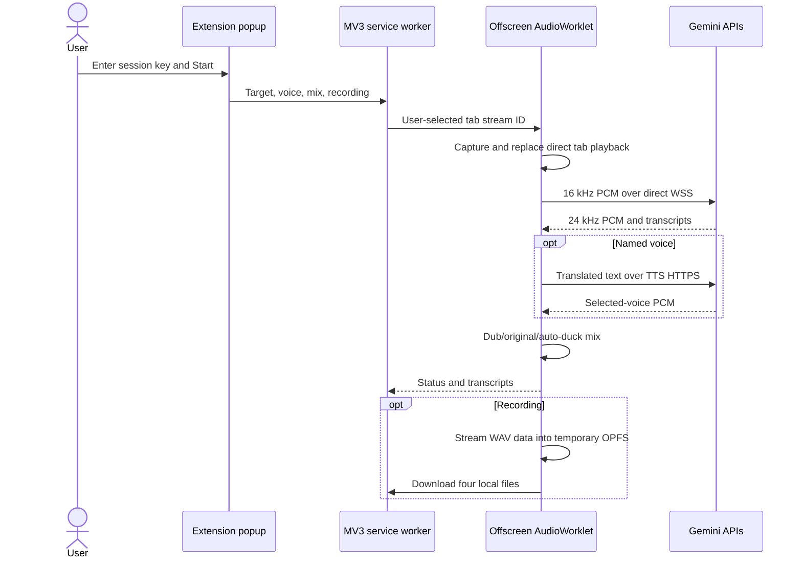

# Architecture

LingoDub contains two independent products. The Windows app handles desktop audio; the Manifest V3 extension handles browser-tab audio. Neither product starts, configures, authenticates, or transports audio for the other.

## Product boundaries

| Product | Capture | Gemini connection | Credentials | Recording |
|---|---|---|---|---|
| Windows app | WASAPI loopback | Python `google-genai` client | Windows Credential Manager or private `.env` | Local WAV/SRT plus ZIP |
| Browser extension | `chrome.tabCapture` + AudioWorklet | Direct Live WebSocket and TTS HTTPS | `chrome.storage.session` | Temporary OPFS, then four Downloads files |

## Desktop modules

| Module | Owns | Does not own |
|---|---|---|
| `ConfigStore` | Desktop settings, keyring, `.env`, proxy environment | HTTP or Gemini calls |
| `AudioEngine` | WASAPI capture, PCM conversion, mixed playback | Translation policy |
| `GeminiGateway` | Google SDK and Live/TTS protocol | Devices, persistence, UI |
| `DubRuntime` | Desktop session lifecycle | Browser APIs |
| `SessionRecorder` | Desktop WAV/SRT/ZIP output | Playback or translation |
| FastAPI app | Local desktop dashboard | Extension traffic |

## Standalone extension sequence

## Security boundaries

- The app binds only to `127.0.0.1:8765`; no extension endpoint exists.
- The extension has no localhost permission, content scripts, remote executable code, or arbitrary-site host access.
- Extension preferences use `chrome.storage.local`; its user-provided key uses session storage and clears when the browser fully exits.
- Extension audio is sent only after an explicit Start action and only to `generativelanguage.googleapis.com`.
- A production store deployment should replace direct long-lived BYOK with a hosted ephemeral-token broker, as recommended by Google.

## Audio contracts

- Input: signed 16-bit little-endian mono PCM at 16 kHz in 100 ms chunks.
- Output: signed 16-bit little-endian mono PCM at 24 kHz.
- Browser downsampling stays off the popup thread in an AudioWorklet.
- Desktop PortAudio callbacks use queues and never block on network work.

No JavaScript framework, bundler, or remotely hosted code is used. Chrome/Edge 116+ can load the extension directory directly.
