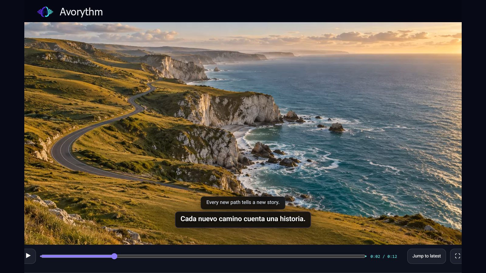

  

<h1 align="center">Avorythm</h1>

<strong>اسمع كل صوت — أو اقرأه فقط — بلغتك.</strong>

  ترجمة ودبلجة مباشرة لصوت سطح المكتب والمتصفح، مع معالجة متزامنة لملفات الصوت والفيديو المرفوعة.

  

  

  <a href="https://github.com/msmahdinejad/avorythm">المصدر على GitHub</a> ·
  <a href="https://chromewebstore.google.com/detail/avorythm-live-translation/kbdbbedijheicmmnmoidamdaodjbhjje">تثبيت إضافة Chrome</a> ·
  <a href="docs/HELP.ar.md">دليل المستخدم بالعربية</a> ·
  <a href="docs/INSTALLATION.md">دليل التثبيت</a> ·
  <a href="PRIVACY.md">الخصوصية</a> ·
  <a href="CONTRIBUTING.md">المساهمة</a>

## اختر طريقة استخدام Avorythm

| الاستخدام | ما تحتاجه | جهاز صوت افتراضي |
|---|---|---|
| ترجمة علامة تبويب Chrome أو Edge | إضافة مستقلة | لا |
| معالجة ملف صوت أو فيديو | تطبيق سطح المكتب وFFmpeg | لا |
| ترجمة VLC أو مشغّل دورة أو تطبيق سطح مكتب آخر مباشرة | تطبيق سطح المكتب ومدخل loopback/monitor | غالبًا |

تطبيق سطح المكتب وإضافة المتصفح مستقلان. لا تحتاج الإضافة إلى التطبيق أو Python أو FFmpeg أو localhost أو كابل صوت افتراضي.

## المزايا

- كلام مترجم مباشرة مع ترجمة المصدر والترجمة المنقولة.
- أربع قنوات مخرجات مستقلة: الصوت الأصلي، الصوت المدبلج، ترجمة المصدر، والترجمة المنقولة.
- مسارا تشغيل للإضافة: تشغيل منخفض التأخير في الصفحة الحالية، أو مشغّل مخصص مؤقت يحافظ على الفيديو الملتقط والدبلجة ومساري الترجمة في خط زمني واحد.
- بطاقة ترجمة زجاجية قابلة للتحريك وتغيير الحجم، مع ضبط حجم النص والعرض والعتامة.
- تسجيل اختياري للملفات `original.wav` و`dubbed.wav` و`source.srt` و`translated.srt`.
- رفع ملفات الصوت والفيديو مع نسخ الكلام المؤرّخ والترجمة والكلام المُولّد وتشغيل متزامن.
- تنزيل ZIP يضم كل المخرجات.
- واجهة سطح مكتب بالفارسية والإنجليزية، وواجهة إضافة متعددة اللغات تشمل الروسية والألمانية والفرنسية والإيطالية والعربية والإسبانية والبرتغالية البرازيلية والتركية والإنجليزية والفارسية والصينية المبسطة، مع اتجاه نص RTL/LTR تلقائي.

## البدء السريع

### تطبيق سطح المكتب

نزّل الإصدار المناسب لنظامك من [صفحة الإصدارات](https://github.com/msmahdinejad/avorythm/releases). يتضمن إصدار Windows برنامج FFmpeg لمعالجة الوسائط المرفوعة. يحتاج التطبيق إلى مفتاح Gemini، ويحتاج Media Studio أيضًا إلى مفتاح Groq لـWhisper. تُخزَّن المفاتيح في سلسلة مفاتيح نظام التشغيل.

### إضافة المتصفح

[ثبّت Avorythm من Chrome Web Store](https://chromewebstore.google.com/detail/avorythm-live-translation/kbdbbedijheicmmnmoidamdaodjbhjje)، أو ثبّتها يدويًا من حزمة الإصدار:

1. فك ضغط `Avorythm-Extension.zip` في مجلد دائم.
2. افتح `chrome://extensions` أو `edge://extensions`.
3. فعّل **وضع المطوّر**، واختر **Load unpacked**، ثم حدّد المجلد المفكوك.
4. ثبّت Avorythm في شريط الأدوات، وافتح صفحة الإعدادات المنفصلة، وأكمل الإعداد قبل بدء الترجمة في علامة وسائط عادية.

اختر **في هذه الصفحة** لأقل تأخير عملي، أو **المسجّل والمشغّل المتزامنان** لتسجيل الالتقاط مسبقًا وتشغيله مع إمكان التقديم وملء الشاشة وتصدير WebM وSRT. يتطلب الوضع الدقيق مفتاح Groq وإذن الوصول إلى `api.groq.com` وموافقة منفصلة لإرسال نوافذ صوت قصيرة إلى Groq Whisper. قد تمنع وسائط DRM التقاط الفيديو.

تملك إعدادات تشغيل الصفحة وإعدادات التشغيل والتصدير المتزامنين قنوات مستقلة. يمكنك اختيار الصوتين ومساري الترجمة ومستويي الصوت وخفض الصوت الأصلي بذكاء قبل التصدير. يحتفظ Chrome مؤقتًا بآخر التقاط متزامن فقط في تخزينه الخاص؛ أما الملفات التي تنزّلها بنفسك فتُحفظ في `Downloads/Avorythm` ولا تُحذف تلقائيًا.

تبقى مفاتيح الإضافة في `chrome.storage.session` افتراضيًا وتُمسح عند إغلاق المتصفح بالكامل. يمكنك تفعيل **تذكّر المفتاح على هذا الجهاز** لكل من Gemini وGroq على حدة. لا تتم مزامنة المفاتيح المتذكَّرة ولا تشفّرها الإضافة؛ عطّل الخيار على الأجهزة المشتركة.

راجع [دليل المستخدم الكامل بالعربية](docs/HELP.ar.md) و[دليل التثبيت وتوجيه الصوت](docs/INSTALLATION.md) لإعداد Windows AMM وloopback في macOS ومصادر monitor في Linux وإعداد الوكيل واستكشاف الأخطاء.

## البيانات والخصوصية

لا تبدأ المعالجة إلا بعد موافقتك والضغط على بدء. يُرسل صوت علامة التبويب المحددة إلى Google Gemini، وفي الوضع الدقيق تُرسل نوافذ الصوت القصيرة إلى Groq Whisper للنسخ والطوابع الزمنية ثم يذهب النص إلى Gemini للترجمة وإنشاء الصوت. تبقى ملفات الوسائط المرفوعة على جهازك، بينما تُرسل مقاطع الصوت والنصوص إلى المزوّدين المطلوبين. لا يحتوي Avorythm على إعلانات أو تحليلات أو خادم ترحيل يديره المطوّر. تسجيل المخرجات الأربعة متوقف افتراضيًا؛ ويسجل الوضع المتزامن علامة التبويب محليًا للتشغيل والتصدير. اقرأ [سياسة الخصوصية](PRIVACY.md) قبل معالجة وسائط خاصة أو محمية بحقوق النشر.

## القيود

قد تمنع الوسائط المحمية بـDRM وصفحات المتصفح الداخلية الالتقاط. تعتمد الترجمة والدبلجة على خدمات الذكاء الاصطناعي وحصص مزوّديها، لذلك قد يتغير التوفر والتأخير والدقة. راجع المحتوى المهم قبل الاعتماد عليه.

## المساهمة والمصدر

الكود المصدري متاح في [مستودع Avorythm على GitHub](https://github.com/msmahdinejad/avorythm). نرحّب بالإبلاغ عن الأخطاء وتحسين الترجمة وإضافة اللغات عبر [دليل المساهمة](CONTRIBUTING.md). شغّل اختبارات المشروع وفحوصاته المحلية قبل إرسال طلب تغيير.

## الترخيص

[MIT](LICENSE) © Mohammad Saleh Mahdinejad. تتضمن حزمة Windows برنامج FFmpeg المرخّص وفق GPLv3؛ راجع إشعارات الجهات الخارجية.
