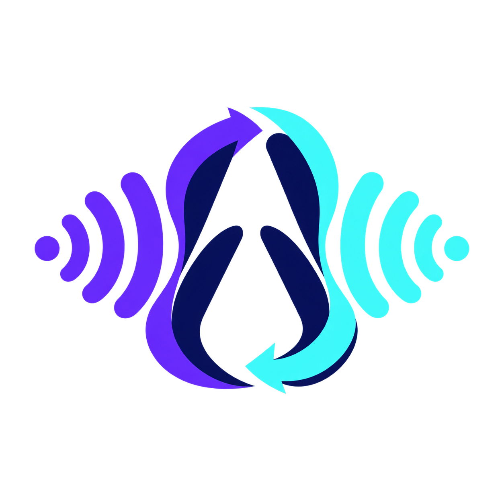

  

<h1 align="center">Avorythm</h1>

<strong>Jede Stimme in Ihrer Sprache – zum Hören oder Lesen.</strong>

  Live-Übersetzung und Vertonung für Desktop- und Browser-Audio sowie synchronisierte
  Verarbeitung hochgeladener Audio- und Videodateien.

  

[Chrome-Erweiterung installieren](https://chromewebstore.google.com/detail/avorythm-live-translation/kbdbbedijheicmmnmoidamdaodjbhjje) ·
[Desktop-App herunterladen](https://github.com/msmahdinejad/avorythm/releases) ·
[Projekt auf GitHub](https://github.com/msmahdinejad/avorythm) ·
[English](README.md)

## Welche Version passt zu Ihnen?

| Aufgabe | Benötigt | Virtuelle Audioweiterleitung |
|---|---|---|
| Einen Chrome- oder Edge-Tab live übersetzen | Browser-Erweiterung | Nein |
| Eine Audio- oder Videodatei verarbeiten | Desktop-App und FFmpeg | Nein |
| VLC oder eine andere Desktop-App live übersetzen | Desktop-App und Loopback-/Monitoreingang | Meistens |

Desktop-App und Browser-Erweiterung funktionieren unabhängig voneinander.
Die Erweiterung benötigt weder Desktop-App noch Python, FFmpeg, localhost oder ein virtuelles Audiokabel.

## Browser-Erweiterung starten

1. Installieren Sie Avorythm über den [Chrome Web Store](https://chromewebstore.google.com/detail/avorythm-live-translation/kbdbbedijheicmmnmoidamdaodjbhjje).
2. Öffnen Sie die Einstellungen und geben Sie Ihren eigenen Gemini-API-Schlüssel aus [Google AI Studio](https://aistudio.google.com/apikey) ein.
3. Erlauben Sie ausdrücklich, dass Audio aus dem von Ihnen ausgewählten Tab an Google Gemini gesendet wird.
4. Öffnen Sie einen Medientab, wählen Sie Zielsprache und Ausgaben und klicken Sie auf **Übersetzung starten**.

**Auf dieser Seite** liefert Audio und Untertitel mit der geringsten praktisch erreichbaren Verzögerung.
**Synchronisierte Aufnahme und Wiedergabe** öffnet einen eigenen Player mit etwa 20 Sekunden Aufnahmevorlauf.
Sie können unabhängig pausieren, im Video springen und den Player im Vollbild verwenden.
Originalton, Vertonung und beide Untertitelspuren folgen dabei derselben aufgezeichneten Zeitleiste.

Für den schnelleren synchronisierten Modus steht Gemini 3.5 Live bereit.
Der präzise Modus verwendet Groq Whisper → Gemini-Textmodelle → Gemini 3.1 Flash Live.
Er benötigt zusätzlich einen [Groq-API-Schlüssel](https://console.groq.com/keys), die Chrome-Berechtigung für `api.groq.com`
und eine separate Einwilligung, kurze Audioabschnitte aus dem ausgewählten Tab direkt an Groq Whisper zu senden.
Groq liefert Transkripte und Zeitstempel; der Text geht anschließend zur Übersetzung und Spracherzeugung an Google Gemini.
In eingeschränkten Netzwerken muss Chrome `api.groq.com` über den Browser- oder System-Proxy erreichen können.

## Desktop-App starten

Laden Sie die passende Version unter [Releases](https://github.com/msmahdinejad/avorythm/releases) herunter.
Die Windows-Version enthält FFmpeg bereits. Hinterlegen Sie Ihren Gemini-Schlüssel in den erweiterten Einstellungen;
für die Dateiverarbeitung wird zusätzlich ein Groq-Schlüssel benötigt. Die App speichert Schlüssel im Schlüsselbund des Betriebssystems.

Für Dateien: Audio oder Video im Dateistudio ablegen, Zielsprache und Stimme wählen und die Verarbeitung starten.
Die Datei bleibt auf Ihrem Computer; extrahierte Audioabschnitte gehen an Groq Whisper und Text bzw. Sprachaufträge an Gemini.
Anschließend stehen die synchronisierte Wiedergabe, vier Ausgabedateien und ein ZIP-Download bereit.

Nur die Live-Übersetzung aus anderen Desktop-Programmen benötigt virtuelle Audioweiterleitung:
Unter Windows geht die Quell-App an AMM Virtual, Avorythm nimmt den virtuellen Eingang auf und gibt über physische Kopfhörer aus.
Unter macOS verwenden Sie etwa BlackHole, unter Linux eine passende PipeWire/PulseAudio-Monitorquelle.
Leiten Sie den Avorythm-Ausgang niemals zurück auf den Aufnahmeeingang, damit keine Rückkopplung entsteht.

## Ausgaben und Aufnahmen

Sie können Originalton, übersetzten Ton, Originaluntertitel und übersetzte Untertitel unabhängig kombinieren.
Die optionale Aufnahme erzeugt `original.wav`, `dubbed.wav`, `source.srt` und `translated.srt`; sie ist standardmäßig deaktiviert.
Die Einstellungen für die Wiedergabe auf der Seite und für die synchronisierte Wiedergabe bzw. den Export sind getrennt.
Der synchronisierte Modus zeichnet den Tab lokal auf und kann Ihre Audiomischung als WebM sowie ausgewählte Untertitel als SRT exportieren.
Ein neuer synchronisierter Mitschnitt ersetzt die vorherige temporäre Aufnahme; heruntergeladene Dateien unter `Downloads/Avorythm` bleiben erhalten.

## API-Schlüssel, Kontingente und Datenschutz

Die Anbieter können kostenlose Kontingente, Modellverfügbarkeit und Nutzungslimits ändern; ein API-Schlüssel garantiert keine unbegrenzte Nutzung.
Bei ausgeschöpften Kontingenten warten Sie auf deren Freigabe. Dateiverarbeitung kann automatisch pausieren, um Tokenlimits einzuhalten.
Erweiterungsschlüssel bleiben standardmäßig nur für die Browsersitzung erhalten und werden beim vollständigen Beenden des Browsers gelöscht.
**Schlüssel auf diesem Gerät merken** ist für Gemini und Groq getrennt verfügbar und standardmäßig ausgeschaltet.
Gespeicherte Schlüssel bleiben ausschließlich in diesem Browserprofil, werden niemals synchronisiert und von der Erweiterung nicht verschlüsselt.
Deaktivieren entfernt die Gerätekopie; **Schlüssel entfernen** löscht zusätzlich den Sitzungsschlüssel.
Avorythm verwendet keine Werbung, Nutzungsanalyse oder vom Entwickler betriebenen Vermittlungsserver.
Die Verarbeitung beginnt erst nach Ihrer Einwilligung und dem Start; lesen Sie die [Datenschutzerklärung auf Englisch](PRIVACY.md).

## Grenzen und Hilfe

DRM-geschützte Medien und interne Browserseiten können Audio- oder Videoaufnahmen blockieren.
KI-Übersetzung verursacht Verzögerungen und kann Fehler enthalten. Prüfen Sie wichtige Inhalte vor der weiteren Verwendung.
Der WebM-Export mischt die lokale Aufnahme durch erneute Wiedergabe; seine Erstellung dauert ungefähr so lange wie die Aufnahme.

Weitere Schritte, Abbildungen und Problemlösungen finden Sie in der [vollständigen Anleitung auf Englisch](docs/HELP.md)
und der [Installations- und Audioanleitung auf Englisch](docs/INSTALLATION.md).
Avorythm steht unter der [MIT-Lizenz](LICENSE); Hinweise zu FFmpeg finden Sie in den [Drittanbieterhinweisen](THIRD_PARTY_NOTICES.md).
