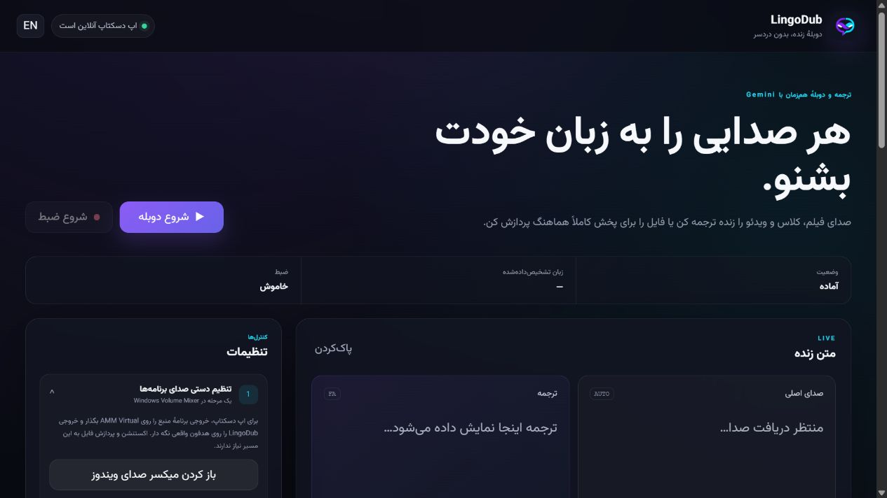

# LingoDub

ترجمه و دوبلهٔ زنده و سینک‌شده با **Gemini 3.5 Live Translate**. پروژه دو محصول کاملاً مستقل دارد:

- اپ ویندوز برای صدای برنامه‌های دسکتاپ و فایل ویدئویی؛
- اکستنشن مستقل Manifest V3 برای تب‌های Chrome/Edge.

[English](README.md) · [آموزش نصب](docs/INSTALLATION.fa.md) · [چک‌لیست Chrome Web Store](docs/CHROME_WEB_STORE.md) · [حریم خصوصی](PRIVACY.md)



## قابلیت‌ها

- ارسال PCM با نرخ 16kHz به `gemini-3.5-live-translate-preview` و پخش گفتار ترجمه‌شدهٔ 24kHz خود مدل؛
- کنترل مستقل صدای اصلی و دوبله، با حالت پیش‌فرض «فقط دوبله»؛
- نمایش متن اصلی و ترجمه با جهت درست RTL/LTR؛
- ضبط چهار خروجی `original.wav`، `source.srt`، `dubbed.wav` و `translated.srt`؛
- اتصال مجدد خودکار برای نشست‌های طولانی Live؛
- پشتیبانی از بیش از ۷۰ زبان رسمی Live Translate؛
- فقط یک مدل Live Translate؛ بدون TTS، STT، Batch یا Files API جداگانه.

### استودیوی فایل ویدئویی

فایل MP4، MKV، WebM، MOV، AVI، WMV، MPEG یا 3GP را داخل اپ رها کن. خود ویدئو روی لپ‌تاپ می‌ماند؛ LingoDub فقط PCM استخراج‌شده با FFmpeg را برای ترجمه می‌فرستد و این موارد را می‌سازد:

- **سینک دقیق** (پیش‌فرض): برش ویدئوی بلند نزدیک سکوت و تنظیم طول گفتار دوبله؛
- **سریع**: پنجره‌های ثابت و هم‌ترازی سبک‌تر؛
- ویدئوپلیر محلی با صدای اصلی و دوبلهٔ مستقل؛
- امکان نمایش هم‌زمان هر دو زیرنویس؛
- چهار فایل جداگانه و `all-outputs.zip`.

ویدئو ساعت اصلی پلیر است؛ اختلاف‌های کوچک با تغییر بسیار جزئی سرعت و اختلاف بیشتر از ۱۲۰ میلی‌ثانیه با seek اصلاح می‌شود. سهمیه‌بان محلی حداکثر ۱۵هزار توکن تخمینی در هر دقیقه رزرو می‌کند تا زیر سقف ۲۰هزار بماند. چون مدل Live فقط ورودی real-time می‌پذیرد، پردازش معمولاً هم‌اندازهٔ زمان گفتار یا بیشتر طول می‌کشد.

## نصب سریع

### اپ ویندوز

1. `LingoDub-Setup-x64.exe` را از Releases بگیر.
2. برای پردازش فایل، گزینهٔ پیشنهادی **Install FFmpeg** را روشن نگه دار.
3. برنامه را باز کن، در تنظیمات پیشرفته Gemini API Key را ذخیره کن و در صورت نیاز Proxy را روی `http://127.0.0.1:10808` بگذار.

کلید در Windows Credential Manager ذخیره می‌شود. نصب‌کننده FFmpeg را با WinGet نصب می‌کند. اگر WinGet موجود نبود بعداً این دستور را اجرا کن:

```powershell
winget install --id Gyan.FFmpeg --exact --scope user
```

### اکستنشن مستقل

1. `LingoDub-Extension.zip` را دانلود و در یک پوشهٔ ثابت Extract کن.
2. `chrome://extensions` یا `edge://extensions` را باز کن.
3. **Developer mode** را روشن کن، **Load unpacked** را بزن و پوشه‌ای را انتخاب کن که `manifest.json` مستقیم داخل آن است.
4. اکستنشن را Pin کن، یک تب ویدئو باز کن، Key را در Popup وارد کن و دوبله را شروع کن.

اکستنشن به اپ ویندوز، Python، localhost، FFmpeg یا Virtual Audio Device نیاز ندارد. نصب یک‌کلیکی اکستنشن unpacked از GitHub طبق سیاست Chrome ممکن نیست؛ دکمهٔ واقعی **Add to Chrome** فقط بعد از انتشار در Chrome Web Store ساخته می‌شود.

کلید اکستنشن عمداً فقط در `chrome.storage.session` نگه‌داری می‌شود و با بسته‌شدن کامل مرورگر پاک می‌شود. کلید و صدای تب مستقیماً به Google می‌روند. برای انتشار production عمومی، معماری امن‌تر پیشنهادی Google یک سرویس HTTPS کوچک برای ساخت ephemeral token کوتاه‌عمر است.

## تنظیم صدای دوبلهٔ زندهٔ دسکتاپ

Virtual Audio فقط برای دوبلهٔ زندهٔ یک برنامه توسط اپ ویندوز لازم است. اکستنشن و بخش فایل ویدئویی هیچ نیازی به آن ندارند.

مسیر درست مطابق تصویر ارسالی:

1. **Output** برنامهٔ منبع/Chrome → `Speakers (AMM Virtual Audio Device)`؛
2. **Input** داخل LingoDub → `Microphone (AMM Virtual Audio Device)` یا Loopback متناظر؛
3. **Output** داخل LingoDub → `Default` یا هدفون واقعی؛
4. صدای اصلی ۰٪ و دوبله ۱۰۰٪.

خروجی LingoDub را هرگز روی AMM نگذار؛ این کار حلقهٔ صوتی و اکو می‌سازد.


آموزش تصویری دو‌زبانه داخل خود اپ در `/audio-guide.html` هم در دسترس است.

## توسعه و تست

نیازمندی‌ها: Windows 10/11 x64، Python 3.11 تا 3.13، Node.js برای تست اکستنشن، و FFmpeg/FFprobe برای Media Studio.

```powershell
py -3.12 -m venv .venv
.\.venv\Scripts\Activate.ps1
python -m pip install -e ".[dev,build]"
python -m pytest -q
python -m ruff check src tests scripts
python -m mypy src
node --test tests\extension.test.mjs tests\offscreen.test.mjs tests\background.test.mjs
```

اجرا:

```powershell
$env:HTTP_PROXY='http://127.0.0.1:10808'
$env:HTTPS_PROXY='http://127.0.0.1:10808'
python -m lingodub
```

ساخت خروجی انتشار:

```powershell
.\scripts\build.ps1
.\scripts\package-extension.ps1
iscc .\installer.iss
```

## امنیت، حریم خصوصی و محدودیت مدل

- اپ فقط روی `127.0.0.1` گوش می‌دهد و ویدئو/خروجی‌ها محلی هستند.
- اکستنشن فقط تبی را Capture می‌کند که کاربر صریحاً Start کرده است.
- هیچ Analytics، تبلیغ، Remote Code یا Telemetry توسعه‌دهنده وجود ندارد.
- فقط محتوایی را پردازش یا ضبط کن که اجازهٔ آن را داری.

Gemini 3.5 Live Translate یک مدل Preview است؛ ثبات صدا، تشخیص گوینده/لهجه، تأخیر، سهمیه و دقت ترجمه تضمین صددرصدی ندارند. مدل انتخاب named voice ارائه نمی‌کند؛ به همین دلیل رابط «صدای خودکار Live» را نشان می‌دهد و TTS جداگانه‌ای جعل نمی‌کند. گفتار ترجمه‌شدهٔ خیلی بلند ممکن است برای حفظ سینک فشرده یا کوتاه شود.

[SECURITY.md](SECURITY.md)، [PRIVACY.md](PRIVACY.md) و [ARCHITECTURE.md](ARCHITECTURE.md) جزئیات را توضیح می‌دهند. پیاده‌سازی بر اساس [راهنمای رسمی Live Translation](https://ai.google.dev/gemini-api/docs/live-api/live-translate)، [صفحهٔ مدل](https://ai.google.dev/gemini-api/docs/models/gemini-3.5-live-translate-preview) و [راهنمای ephemeral token](https://ai.google.dev/gemini-api/docs/live-api/ephemeral-tokens) است.

## مجوز

MIT. مجوز Vazirmatn و موارد ثالث در [THIRD_PARTY_NOTICES.md](THIRD_PARTY_NOTICES.md) آمده است.
