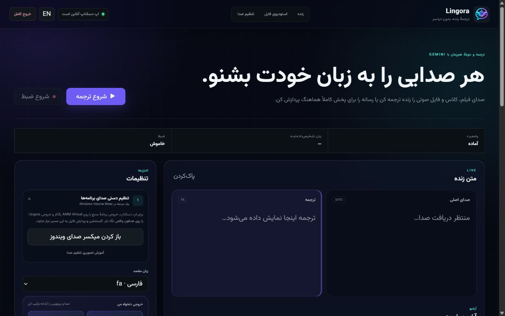
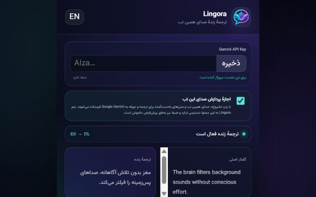

<div dir="rtl">

<p align="center">
  
</p>

<h1 align="center">Lingora</h1>

<p align="center"><strong>هر صدایی را به زبان خودت بشنو—یا فقط ترجمه‌اش را بخوان.</strong></p>

<p align="center">
  ترجمه و دوبلهٔ زندهٔ صدای دسکتاپ و مرورگر، همراه با پردازش هماهنگ فایل‌های صوتی و ویدئویی.
</p>

<p align="center">
  <a href="https://github.com/msmahdinejad/lingora/actions/workflows/ci.yml"></a>
  <a href="https://github.com/msmahdinejad/lingora/releases"></a>
  
  
  <a href="LICENSE"></a>
</p>

<p align="center">
  <a href="README.md">English</a> ·
  <a href="docs/INSTALLATION.fa.md">نصب و تنظیم صدا</a> ·
  <a href="PRIVACY.md">حریم خصوصی</a> ·
  <a href="SUPPORT.md">پشتیبانی</a> ·
  <a href="CONTRIBUTING.md">مشارکت</a>
</p>



## کدام نسخه برای من مناسب است؟

| کاربرد | چیزهایی که لازم است | دستگاه صوتی مجازی |
|---|---|---|
| ترجمهٔ یک تب Chrome یا Edge | فقط اکستنشن مستقل | خیر |
| پردازش فایل صوتی یا ویدئویی | اپ دسکتاپ و FFmpeg | خیر |
| ترجمهٔ زندهٔ VLC، پخش‌کنندهٔ دوره یا برنامهٔ دسکتاپ | اپ و یک ورودی Loopback/Monitor | معمولاً بله |

اپ دسکتاپ و اکستنشن کاملاً مستقل‌اند. اکستنشن برای کارکردن به اپ، Python، FFmpeg،
localhost یا کابل صوتی مجازی نیاز ندارد.

## امکانات

- پخش صدای ترجمه‌شده همراه متن زبان اصلی و ترجمه.
- چهار خروجی مستقل: صدای اصلی، صدای دوبله، زیرنویس زبان اصلی و زیرنویس ترجمه‌شده.
- کادر زیرنویس شیشه‌مات، قابل‌جابه‌جایی و تغییر اندازه با تنظیم اندازهٔ متن، عرض و شفافیت.
- ذخیرهٔ اختیاری چهار فایل `original.wav`، `dubbed.wav`، `source.srt` و `translated.srt`.
- پردازش فایل صوتی و ویدئویی با متن زمان‌بندی‌شده، ترجمه، ساخت صدا و پخش هماهنگ.
- دانلود همهٔ خروجی‌ها در یک فایل ZIP.
- رابط فارسی و انگلیسی با تشخیص خودکار جهت راست‌چین و چپ‌چین.
- پنجرهٔ مستقل دسکتاپ برای Windows، macOS و Linux.



## شروع سریع

### اپ دسکتاپ

نسخهٔ مناسب سیستم‌عاملت را از [Releases](https://github.com/msmahdinejad/lingora/releases) دانلود کن.
در Windows فایل `Lingora-Setup-x64.exe` را نصب کن؛ در macOS و Linux فایل ZIP مربوط را باز کن.
اگر می‌خواهی فایل صوتی یا ویدئویی پردازش کنی، نصب FFmpeg را فعال نگه دار.

اپ به کلید Gemini نیاز دارد. برای استودیوی فایل باید کلید Groq را هم وارد کنی.
کلیدها در Keyring سیستم‌عامل نگه داشته می‌شوند.

### اکستنشن مرورگر

پس از در دسترس قرارگرفتن نسخهٔ Chrome Web Store از همان نسخه استفاده کن. برای نصب دستی از Release:

1. فایل `Lingora-Extension.zip` را در یک پوشهٔ ثابت از حالت فشرده خارج کن.
2. `chrome://extensions` یا `edge://extensions` را باز کن.
3. **Developer mode** را روشن کن، **Load unpacked** را بزن و پوشهٔ اکستنشن را انتخاب کن.
4. Lingora را Pin کن، کلید Gemini را برای نشست فعلی وارد کن و ترجمه را روی یک تب عادی دارای صدا شروع کن.

کلید اکستنشن فقط در `chrome.storage.session` می‌ماند و با خروج کامل از مرورگر پاک می‌شود.

برای تنظیم AMM در Windows، ورودی Loopback در macOS، Monitor در Linux، پروکسی و رفع خطاها،
[راهنمای کامل نصب و تنظیم صدا](docs/INSTALLATION.fa.md) را ببین.

## پردازش داده‌ها

- صدای زندهٔ دسکتاپ یا تب انتخاب‌شده فقط پس از شروع ترجمه از سوی کاربر به Google Gemini فرستاده می‌شود.
- فایل آپلودشده روی رایانه می‌ماند؛ قطعه‌های صوتی استخراج‌شده برای تبدیل گفتار به متن به Groq Whisper و متن و درخواست ساخت صدا به Gemini می‌روند.
- تنظیمات و فایل‌های خروجی محلی می‌مانند. Lingora تبلیغ، ردیابی یا آمارگیری برای توسعه‌دهنده ندارد.
- ضبط اختیاری است و به‌طور پیش‌فرض خاموش می‌ماند.

پیش از پردازش رسانهٔ خصوصی یا دارای حق نشر، [سیاست حریم خصوصی دوزبانه](PRIVACY.md) را بخوان.

## توسعه و مشارکت

پیش‌نیازها: Python 3.12، Node.js 20 یا جدیدتر و FFmpeg برای استودیوی فایل.

```powershell
python -m venv .venv
.\.venv\Scripts\Activate.ps1
python -m pip install -e ".[dev,build]"
python -m pytest -q
python -m ruff check src tests scripts
python -m mypy src
node --test tests\*.test.mjs
python -m lingora
```

ساخت اپ و بسته‌بندی اکستنشن:

```powershell
python scripts/build.py
.\scripts\package-extension.ps1
```

اسناد مشارکت‌کنندگان: [معماری](ARCHITECTURE.md)، [راهنمای مشارکت](CONTRIBUTING.md)،
[سیاست امنیت](SECURITY.md)، [پشتیبانی](SUPPORT.md) و [تغییرات نسخه‌ها](CHANGELOG.md).

## اطمینان از فایل انتشار

فایل دانلودشده را با `SHA256SUMS.txt` همان Release بررسی کن. قواعد امضای Windows و روش
اعتبارسنجی آن در [سیاست امضای کد](CODE_SIGNING_POLICY.md) آمده است.

Free code signing provided by [SignPath.io](https://signpath.io/), certificate by
[SignPath Foundation](https://signpath.org/).

## وضعیت پروژه

Lingora در حال توسعه است و از سرویس‌های آزمایشی هوش مصنوعی استفاده می‌کند. دقت ترجمه، صدا،
تأخیر، دسترس‌پذیری و سهمیه‌ها ممکن است تغییر کنند؛ نتیجه‌های مهم را پیش از استفاده بررسی کن.

## مجوز

[MIT](LICENSE) © Mohammad Saleh Mahdinejad

</div>
