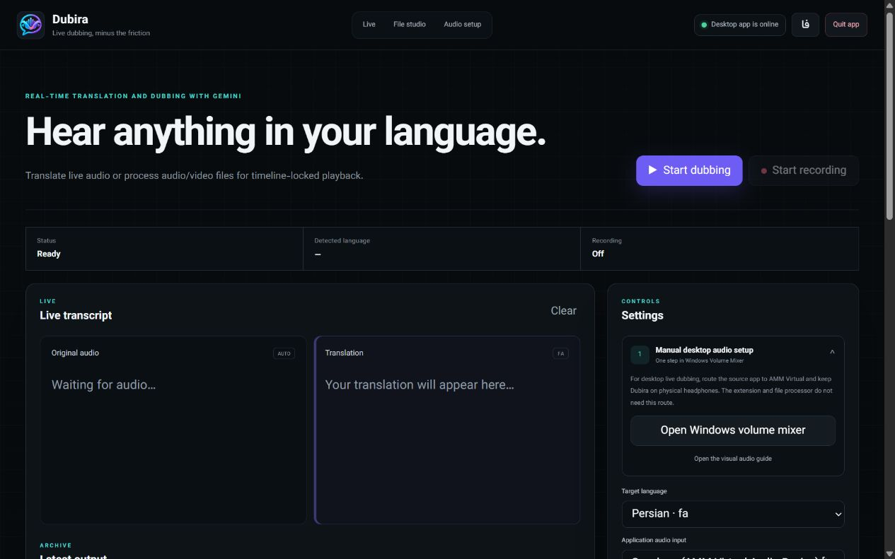

<p align="center">
  
</p>

<h1 align="center">Lingora</h1>

<p align="center"><strong>هر صدایی را به زبان خودت بشنو—یا فقط ترجمه‌اش را بخوان.</strong></p>

<p align="center">
  ترجمه و دوبلهٔ زندهٔ صدای دسکتاپ و مرورگر، زیرنویس شناور روی همهٔ پنجره‌ها،
  و تبدیل فایل صوتی/ویدئویی به دوبلهٔ هماهنگ و چهار خروجی قابل دانلود.
</p>

<p align="center">
  <a href="https://github.com/msmahdinejad/lingora/actions/workflows/ci.yml"></a>
  <a href="https://github.com/msmahdinejad/lingora/releases"></a>
  
  
  <a href="LICENSE"></a>
</p>

<p align="center">
  <a href="README.md">English</a> ·
  <a href="docs/INSTALLATION.fa.md">نصب کامل</a> ·
  <a href="docs/CHROME_WEB_STORE.md">انتشار اکستنشن</a> ·
  <a href="PRIVACY.md">حریم خصوصی</a>
</p>



## اجزای پروژه

- **اپ بومی Windows، macOS و Linux:** ترجمه/دوبلهٔ زنده، ضبط، و استودیوی فایل در یک پوستهٔ سبک pywebview.
- **اکستنشن مستقل Chrome/Edge:** بدون نصب اپ، Python، FFmpeg، localhost یا کابل صوتی مجازی کار می‌کند.
- **زیرنویس شناور:** صدای اصلی پخش می‌شود و ترجمه داخل کادر شیشه‌مات نمایش داده می‌شود. اندازهٔ متن، عرض، شفافیت و نمایش متن اصلی قابل کنترل است. کادر اپ همیشه روی پنجره‌ها می‌ماند؛ کادر اکستنشن را داخل صفحه می‌توان کشید و resize کرد.

هر دو رابط فارسی/انگلیسی هستند، از Vazirmatn استفاده می‌کنند و راست‌چین/چپ‌چین متن را خودکار تشخیص می‌دهند.

## خروجی زندهٔ شخصی‌سازی‌شده

اپ و اکستنشن چهار کانال مستقل دارند: صدای اصلی، صدای دوبله، زیرنویس اصلی و زیرنویس ترجمه.
هر ترکیبی را می‌توان روشن کرد. وقتی هر دو صدا فعال‌اند، دو اسلایدر ولوم میکس دقیق را تعیین
می‌کنند و تنظیم ظاهر کادر با روشن‌بودن هرکدام از زیرنویس‌ها در دسترس می‌ماند.

در مرورگرهای سازگار، کادر اپ با Document Picture-in-Picture ساخته می‌شود و fallback آن پنجرهٔ جداست. نسخهٔ بومی Lingora یک پنجرهٔ pywebview واقعی، قابل‌جابه‌جایی و Always-on-top دارد.

## پردازش فایل صوتی و ویدئویی

```text
صوت/ویدئو
  → استخراج و تایم‌لاین محلی با FFmpeg
  → تبدیل گفتار به متن با Groq Whisper Large v3
  → ترجمه با قوی‌ترین مدل رایگان قابل‌دسترسی Gemini/Gemma
  → تولید صدای ترجمه با Gemini 3.1 Flash Live
  → هماهنگ‌سازی، زیرنویس‌های کوتاه، پلیر و ZIP
```

هر پروژهٔ موفق `original.wav`، `source.srt`، `dubbed.wav`، `translated.srt` و `all-outputs.zip` می‌دهد. پلیر، رسانهٔ اصلی را ساعت مرجع می‌گیرد، اختلاف بیشتر از ۱۲۰ میلی‌ثانیه را اصلاح می‌کند، صدای اصلی را با خاموش‌بودن سوییچ واقعاً mute می‌کند و هر دو زیرنویس را مستقل نشان می‌دهد.

حالت **دقیق** از `whisper-large-v3` استفاده و متن صدای تولیدشده را کنترل می‌کند. حالت **سریع** از `whisper-large-v3-turbo` استفاده می‌کند. محدودکنندهٔ محلی حداکثر ۱۵ هزار توکن تخمینی Gemini را در هر ۶۰ ثانیه رزرو می‌کند تا زیر سقف درخواستی ۲۰ هزار TPM بماند.

## نصب سریع

### ویندوز

1. `Lingora-Setup-x64.exe` را از [Releases](https://github.com/msmahdinejad/lingora/releases) بگیر.
2. برای پردازش فایل، تیک **Install FFmpeg** را روشن نگه دار.
3. Gemini API Key را ذخیره کن؛ برای استودیوی فایل Groq API Key هم لازم است.
4. اگر اتصال نیاز دارد، پروکسی `http://127.0.0.1:10808` را نگه دار.

تا وقتی فایل نصب با گواهی Authenticode معتبر امضا نشده، SmartScreen ممکن است «Unknown publisher» نشان دهد. حذف مطمئن این پیام فقط با code-signing معتبر و ساخت reputation ناشر ممکن است.

### macOS و Linux

فایل `Lingora-Darwin-*.zip` یا `Lingora-Linux-*.zip` را دانلود و اجرا کن. برای استودیوی فایل باید FFmpeg در `PATH` باشد. در macOS یک ورودی loopback مثل BlackHole و در Linux ورودی monitor مربوط به PipeWire/PulseAudio را انتخاب کن. پردازش فایل به دستگاه مجازی نیاز ندارد.

### اکستنشن Chrome/Edge

1. `Lingora-Extension.zip` را دانلود و Extract کن.
2. `chrome://extensions` یا `edge://extensions` را باز کن.
3. Developer mode را روشن و **Load unpacked** را بزن.
4. پوشهٔ Extractشده را انتخاب، Lingora را Pin و API Key را برای همان نشست مرورگر وارد کن.
5. یک صفحهٔ عادی دارای رسانه را باز کن و Start را بزن. صفحه‌های داخلی مثل `chrome://` اجازهٔ تزریق زیرنویس نمی‌دهند.

نصب واقعاً یک‌کلیکی فقط بعد از انتشار امضاشده در Chrome Web Store ممکن است؛ GitHub اجازهٔ نصب خاموش اکستنشن unpacked را ندارد.

## مسیر صدای اپ در ویندوز

فقط ترجمهٔ زندهٔ برنامهٔ دیگری در اپ به این مسیر نیاز دارد:

1. خروجی مرورگر/برنامهٔ منبع → `Speakers (AMM Virtual Audio Device)`
2. ورودی Lingora → `Microphone (AMM Virtual Audio Device)`
3. خروجی Lingora → `Default` یا هدفون/اسپیکر واقعی
4. خروجی Lingora را هیچ‌وقت دوباره روی AMM نگذار؛ حلقهٔ اکو می‌سازد.

اکستنشن خودش صدای تب را می‌گیرد و به این تنظیم نیاز ندارد. [آموزش تصویری](docs/INSTALLATION.fa.md#audio-routing-for-the-windows-app) را ببین.

## توسعه و ساخت

```powershell
python -m venv .venv
.\.venv\Scripts\Activate.ps1
python -m pip install -e ".[dev,build]"
python -m pytest -q
python -m ruff check src tests scripts
python -m mypy src
node --test tests\*.test.mjs
python -m lingora
```

```powershell
python scripts/build.py
.\scripts\package-extension.ps1
```

CI روی Windows، macOS و Linux تست، lint، type-check و اعتبارسنجی اکستنشن را اجرا می‌کند. Release تگ‌دار برای هر سه سیستم‌عامل خروجی می‌سازد.

## حریم خصوصی و محدودیت‌ها

- سرویس اپ فقط روی `127.0.0.1` است؛ فایل‌ها و خروجی‌ها در پوشهٔ محلی Lingora می‌مانند.
- قطعه‌های صوتی آپلودی برای transcription به Groq و متن برای ترجمه/تولید صدا به Gemini می‌رود.
- صدای زنده فقط بعد از Start صریح کاربر فرستاده می‌شود.
- کلید اکستنشن در `chrome.storage.session` است و با پایان نشست مرورگر حذف می‌شود. نسخهٔ عمومی Web Store بهتر است از سرویس HTTPS کوچک برای ساخت ephemeral token رسمی Google استفاده کند.
- مدل‌های Preview ممکن است از نظر دقت، تأخیر، صدا، سهمیه و دسترس‌پذیری تغییر کنند.

[MIT](LICENSE) © Mohammad Saleh Mahdinejad
