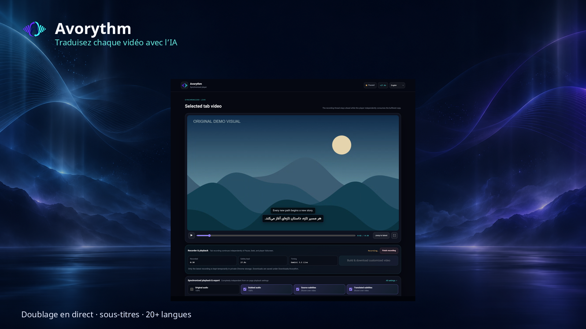

  

<h1 align="center">Avorythm</h1>

<strong>Écoutez chaque voix — ou lisez simplement les sous-titres — dans votre langue.</strong>

  Traduction et doublage en direct pour l’audio du bureau et du navigateur,
  avec traitement synchronisé des fichiers audio et vidéo.

  

  <a href="README.md">English</a> ·
  <a href="https://chromewebstore.google.com/detail/avorythm-live-translation/kbdbbedijheicmmnmoidamdaodjbhjje">Installer l’extension Chrome</a> ·
  <a href="docs/HELP.md">Guide complet en anglais</a> ·
  <a href="PRIVACY.md">Confidentialité</a> ·
  <a href="CONTRIBUTING.md">Contribuer</a>

## Choisissez votre usage

L’application de bureau et l’extension de navigateur sont indépendantes. L’extension traduit un onglet Chrome ou Edge sans application de bureau, Python, FFmpeg, serveur local ni câble audio virtuel. L’application traduit l’audio d’autres programmes en direct et traite vos fichiers audio ou vidéo dans Media Studio.

Les quatre sorties se règlent séparément : audio d’origine, audio doublé, sous-titres d’origine et sous-titres traduits. Vous pouvez écouter uniquement le doublage, conserver les deux voix ou lire les sous-titres sans voix traduite. L’enregistrement facultatif produit deux fichiers WAV et deux fichiers SRT ; Media Studio permet aussi de télécharger une archive ZIP.

## Démarrer

Pour l’extension, [installez Avorythm depuis le Chrome Web Store](https://chromewebstore.google.com/detail/avorythm-live-translation/kbdbbedijheicmmnmoidamdaodjbhjje), ouvrez ses paramètres, ajoutez votre clé API Gemini de Google AI Studio et autorisez explicitement l’envoi de l’audio de l’onglet sélectionné à Google Gemini. Choisissez ensuite la langue cible et appuyez sur **Démarrer la traduction**.

Le mode **Sur cette page** diffuse la traduction et les sous-titres sur la page d’origine avec le délai le plus faible possible. Le mode **Enregistreur et lecteur synchronisés** ouvre un lecteur indépendant ; la capture garde une avance d’environ 20 secondes pour permettre la pause, la recherche et le plein écran tout en conservant une chronologie commune. La capture continue pendant les commandes du lecteur.

Le lecteur synchronisé propose Gemini 3.5 Live pour une mise en route plus rapide, ou un mode précis associant Groq Whisper, les modèles de traduction Gemini et Gemini 3.1 Flash Live. Le mode précis nécessite une clé API Groq, l’autorisation de connexion à `api.groq.com` et un consentement distinct pour l’envoi de courts segments audio à Groq. Les commandes des quatre sorties du lecteur synchronisé et de son exportation sont distinctes de celles du mode Sur cette page. L’exportation produit une vidéo WebM avec le mixage choisi et les pistes SRT activées ; sa création prend environ la durée de l’enregistrement.

Pour l’application de bureau, téléchargez la version de votre système dans les [versions publiées](https://github.com/msmahdinejad/avorythm/releases), puis ajoutez votre clé Gemini dans les paramètres avancés. Media Studio nécessite aussi une clé Groq pour la transcription Whisper. La version Windows inclut FFmpeg. La traduction en direct d’un programme de bureau nécessite généralement une entrée de bouclage ou de retour audio ; le traitement de fichiers et l’extension n’en ont pas besoin. Consultez le [guide d’installation et de routage audio en anglais](docs/INSTALLATION.md).

## Clés et confidentialité

Dans l’extension, les clés restent uniquement dans la session du navigateur par défaut et sont effacées lorsque celui-ci se ferme complètement. L’option **Mémoriser la clé sur cet appareil**, désactivée par défaut et réglable séparément pour Gemini et Groq, les conserve dans le profil local du navigateur. Ce stockage n’est pas chiffré par l’extension et n’est jamais synchronisé. Désactiver cette option supprime la copie locale ; effacer la clé supprime les copies locale et de session. L’application de bureau utilise le trousseau sécurisé du système.

Le traitement commence après votre action et les consentements requis. Les modes Gemini directs envoient l’audio à Google Gemini. Le mode précis de l’extension envoie de courts segments audio directement à Groq Whisper, puis leur transcription à Gemini pour la traduction et la voix. Dans Media Studio, le fichier reste sur l’ordinateur, mais les segments audio vont à Groq et le texte aux services Gemini.

Avorythm ne contient ni publicité, ni outil d’analyse, ni télémétrie du développeur, ni serveur relais exploité par celui-ci. L’enregistrement classique des quatre sorties est désactivé par défaut. Le mode synchronisé enregistre localement pour permettre la lecture et l’exportation ; seule la dernière capture est conservée temporairement. Les fichiers téléchargés restent dans `Downloads/Avorythm`. Consultez la [politique de confidentialité](PRIVACY.md) avant de traiter des contenus privés.

## Limites et contributions

La latence, la qualité des traductions, les voix disponibles et les quotas dépendent des services d’IA, de leurs offres gratuites et de votre connexion. Ces conditions peuvent évoluer ; vérifiez les traductions importantes. Les médias protégés par DRM et les pages internes du navigateur peuvent bloquer la capture.

Le [code source](https://github.com/msmahdinejad/avorythm) est disponible sous [licence MIT](LICENSE). Pour développer, signaler un problème ou proposer une amélioration, consultez le [README principal en anglais](README.md), le [guide de contribution](CONTRIBUTING.md) et l’[assistance](SUPPORT.md). Le [guide utilisateur complet en anglais](docs/HELP.md) présente les réglages, l’enregistrement et le dépannage.
