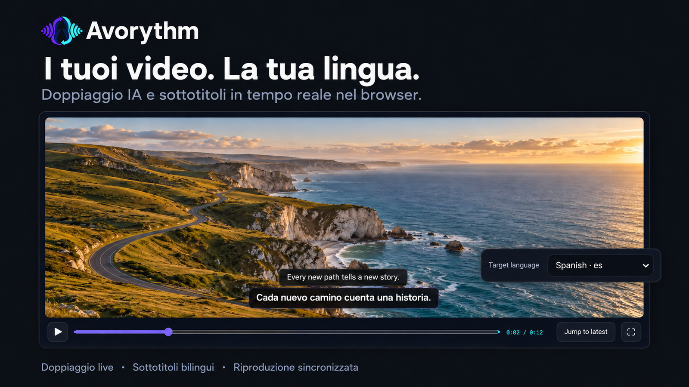

  

<h1 align="center">Avorythm</h1>

<strong>Ascolta ogni voce, o leggila, nella tua lingua.</strong>

Traduzione e doppiaggio in tempo reale per browser e desktop, con elaborazione sincronizzata dei file audio e video.

  

  <a href="README.md">English</a> ·
  <a href="README.fa.md">فارسی</a> ·
  <a href="README.zh-CN.md">简体中文</a> ·
  <a href="https://chromewebstore.google.com/detail/avorythm-live-translation/kbdbbedijheicmmnmoidamdaodjbhjje">Installa l'estensione Chrome</a> ·
  <a href="docs/HELP.it.md">Guida completa</a> ·
  <a href="PRIVACY.md">Privacy</a>

## Scegli come usare Avorythm

| Vuoi… | Ti serve | Dispositivo audio virtuale |
|---|---|---|
| Tradurre una scheda Chrome o Edge | L'estensione autonoma | No |
| Doppiare un file audio o video | L'app desktop e FFmpeg | No |
| Tradurre in diretta VLC o un'altra app desktop | L'app desktop e un ingresso di loopback o monitor | Di solito sì |

App desktop ed estensione funzionano in modo indipendente. L'estensione non richiede Python, FFmpeg, localhost o un cavo audio virtuale.

## Inizia con l'estensione

1. [Installa Avorythm dal Chrome Web Store](https://chromewebstore.google.com/detail/avorythm-live-translation/kbdbbedijheicmmnmoidamdaodjbhjje) e fissa la sua icona alla barra degli strumenti.
2. Apri le impostazioni, inserisci la tua chiave API Gemini ottenuta da Google AI Studio e autorizza l'invio dell'audio della scheda selezionata a Google Gemini.
3. Apri una scheda con il video o l'audio da tradurre, scegli la lingua di destinazione e premi **Avvia traduzione**.
4. Combina audio originale, audio doppiato, sottotitoli originali e sottotitoli tradotti come preferisci: i quattro canali sono indipendenti.

Scegli **Su questa pagina** per il minor ritardo possibile. Puoi spostare e ridimensionare il riquadro dei sottotitoli e regolarne testo, larghezza e opacità.

Scegli **Registratore e lettore sincronizzati** per mettere in pausa, spostarti nel video e usare lo schermo intero senza interrompere la registrazione della scheda. Un anticipo di circa 20 secondi aiuta a mantenere stabile il doppiaggio.

Il motore **Gemini 3.5 Live** offre un avvio più rapido. La modalità precisa usa **Groq Whisper**, i modelli Gemini gratuiti per la traduzione e **Gemini 3.1 Flash Live** per la voce. Richiede una chiave Groq, il permesso di accesso a `api.groq.com` e un consenso separato per inviare brevi segmenti audio a Groq.

Su reti con restrizioni, Chrome deve raggiungere sia Google sia `api.groq.com` tramite il proxy del browser o del sistema. Consulta la [guida completa](docs/HELP.it.md) se la connessione non parte.

## Registra ed esporta

Il salvataggio ordinario è facoltativo e disattivato per impostazione predefinita. Attivalo per scaricare `original.wav`, `dubbed.wav`, `source.srt` e `translated.srt`.

La modalità sincronizzata registra invece la scheda sul dispositivo per consentire la riproduzione e l'esportazione. Al termine, scegli il mix audio e le tracce dei sottotitoli, poi premi **Crea e scarica il video personalizzato**. Riceverai un video WebM e i file SRT selezionati.

La creazione del WebM riproduce una volta la registrazione locale: può richiedere circa la durata del video. I download vengono salvati in `Downloads/Avorythm`. Chrome conserva temporaneamente soltanto l'ultima registrazione sincronizzata; avviarne una nuova sostituisce la precedente, ma non cancella i file già scaricati.

## Usa l'app desktop

Scarica la versione per il tuo sistema dalle [Release](https://github.com/msmahdinejad/avorythm/releases). Il pacchetto Windows include FFmpeg; macOS e Linux hanno pacchetti dedicati.

Apri le impostazioni avanzate e aggiungi la chiave Gemini. Per elaborare file in **Studio file**, aggiungi anche una chiave Groq. Nell'app desktop le chiavi vengono custodite nel portachiavi del sistema operativo.

Trascina un file audio o video in Studio file, scegli lingua e voce, quindi avvia l'elaborazione. Puoi ascoltare il risultato sincronizzato e scaricare i due WAV e i due SRT, anche insieme in uno ZIP.

Per tradurre in diretta un'altra app desktop serve un ingresso di loopback: su Windows indirizza l'app sorgente ad **AMM Virtual** e lascia l'uscita di Avorythm sulle cuffie fisiche. Su macOS usa un ingresso come BlackHole; su Linux una sorgente monitor PipeWire/PulseAudio. L'estensione e l'elaborazione dei file non richiedono questa configurazione.

## Chiavi, consenso e privacy

- Nell'estensione, le chiavi restano nella sessione per impostazione predefinita e vengono rimosse alla chiusura completa del browser. **Ricorda la chiave su questo dispositivo** è inizialmente disattivato e si attiva separatamente per Gemini e Groq.
- Se attivi il salvataggio, la chiave resta in chiaro nel profilo di quel browser: l'estensione non la cifra e non la sincronizza. Disattivare l'opzione elimina la copia sul dispositivo; rimuovere la chiave elimina anche la copia di sessione.
- La traduzione parte dopo il consenso a Google e la pressione di Avvia. La modalità precisa richiede inoltre un consenso audio distinto per Groq; il testo trascritto passa poi a Google per traduzione e voce.
- I file caricati restano sul computer; i segmenti audio vengono inviati a Groq Whisper e il testo a Gemini. Avorythm non usa pubblicità, analisi dell'utilizzo o server intermediari gestiti dagli sviluppatori.

Leggi l'[informativa sulla privacy](PRIVACY.md) prima di elaborare contenuti riservati. I servizi IA possono introdurre ritardi ed errori: verifica le traduzioni importanti. I contenuti protetti da DRM e le pagine interne del browser possono impedire l'acquisizione.

## Aiuto e licenza

Consulta la [guida italiana](docs/HELP.it.md), le [istruzioni di installazione](docs/INSTALLATION.md) e il [supporto](SUPPORT.md). Puoi verificare i download con `SHA256SUMS.txt` della stessa release.

[MIT](LICENSE) © Mohammad Saleh Mahdinejad. Il pacchetto Windows comprende anche FFmpeg sotto GPLv3; consulta gli [avvisi di terze parti](THIRD_PARTY_NOTICES.md).
