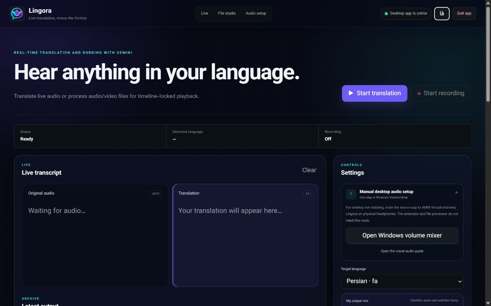
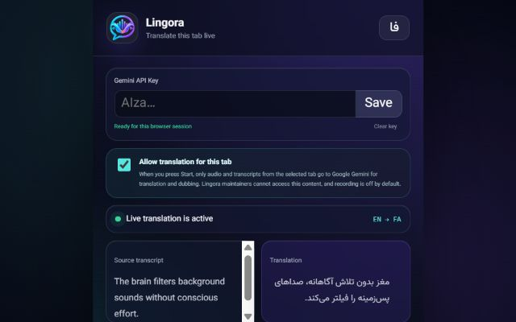

<p align="center">
  
</p>

<h1 align="center">Lingora</h1>

<p align="center"><strong>Hear every voice—or just read it—in your language.</strong></p>

<p align="center">
  Live translation and dubbing for desktop and browser audio, plus synchronized processing
  for uploaded audio and video.
</p>

<p align="center">
  <a href="https://github.com/msmahdinejad/lingora/actions/workflows/ci.yml"></a>
  <a href="https://github.com/msmahdinejad/lingora/releases"></a>
  
  
  <a href="LICENSE"></a>
</p>

<p align="center">
  <a href="README.fa.md">فارسی</a> ·
  <a href="docs/INSTALLATION.md">Installation</a> ·
  <a href="PRIVACY.md">Privacy</a> ·
  <a href="SUPPORT.md">Support</a> ·
  <a href="CONTRIBUTING.md">Contributing</a>
</p>



## Choose how you use Lingora

| Use case | What you need | Virtual audio device |
|---|---|---|
| Translate a Chrome or Edge tab | Standalone extension | No |
| Process an audio or video file | Desktop app and FFmpeg | No |
| Translate VLC, a course player, or another desktop app live | Desktop app and a loopback/monitor input | Usually |

The desktop app and browser extension are independent. The extension does not require the app,
Python, FFmpeg, localhost, or a virtual audio cable.

## Features

- Live translated speech with source and translated captions.
- Four independent output channels: original audio, dubbed audio, source subtitles, and translated subtitles.
- A movable, resizable frosted-glass subtitle card with adjustable size, width, and opacity.
- Optional recording of `original.wav`, `dubbed.wav`, `source.srt`, and `translated.srt`.
- Audio/video upload with timestamped transcription, translation, generated speech, and synchronized playback.
- A ZIP download containing all generated outputs.
- Persian and English interfaces with automatic RTL/LTR text direction.
- Native desktop windows for Windows, macOS, and Linux.



## Quick start

### Desktop app

Download the build for your operating system from [Releases](https://github.com/msmahdinejad/lingora/releases).
Windows users can install `Lingora-Setup-x64.exe`; macOS and Linux users can extract the matching
ZIP. Keep FFmpeg enabled during Windows setup if you want to process uploaded media.

The app needs a Gemini API key. Media Studio additionally needs a Groq API key for Whisper.
Keys are stored in the operating-system keyring.

### Browser extension

Use the Chrome Web Store version when it is available. For a manual installation from a release:

1. Extract `Lingora-Extension.zip` into a permanent folder.
2. Open `chrome://extensions` or `edge://extensions`.
3. Enable **Developer mode**, select **Load unpacked**, and choose the extracted folder.
4. Pin Lingora, enter your Gemini key for the current browser session, and start translation on a normal media tab.

The extension key is kept only in `chrome.storage.session` and is cleared when the browser fully exits.

See the [complete installation and audio-routing guide](docs/INSTALLATION.md) for Windows AMM,
macOS loopback, Linux monitor sources, proxy setup, and troubleshooting.

## Data processing

- Live desktop and selected-tab audio is sent to Google Gemini only after the user starts translation.
- Uploaded media stays on the computer; extracted audio chunks go to Groq Whisper, while transcript text and generated speech requests go to Gemini.
- Preferences and generated files remain local. Lingora has no analytics, advertising, or developer telemetry.
- Recording is optional and disabled by default.

Read the bilingual [privacy policy](PRIVACY.md) before processing private or copyrighted media.

## Development

Requirements: Python 3.12, Node.js 20+, and FFmpeg for Media Studio.

```powershell
python -m venv .venv
.\.venv\Scripts\Activate.ps1
python -m pip install -e ".[dev,build]"
python -m pytest -q
python -m ruff check src tests scripts
python -m mypy src
node --test tests\*.test.mjs
python -m lingora
```

Build the current platform and package the extension:

```powershell
python scripts/build.py
.\scripts\package-extension.ps1
```

Contributor documentation: [architecture](ARCHITECTURE.md), [contributing guide](CONTRIBUTING.md),
[security policy](SECURITY.md), [support](SUPPORT.md), and [changelog](CHANGELOG.md).

## Release trust

Verify downloads against `SHA256SUMS.txt` from the same GitHub Release. Windows signing and
verification rules are documented in the [code-signing policy](CODE_SIGNING_POLICY.md).

Free code signing provided by [SignPath.io](https://signpath.io/), certificate by
[SignPath Foundation](https://signpath.org/).

## Project status

Lingora is under active development and uses preview AI services. Accuracy, voices, latency,
availability, and upstream quotas can change. Review important translations before relying on them.

## License

[MIT](LICENSE) © Mohammad Saleh Mahdinejad
