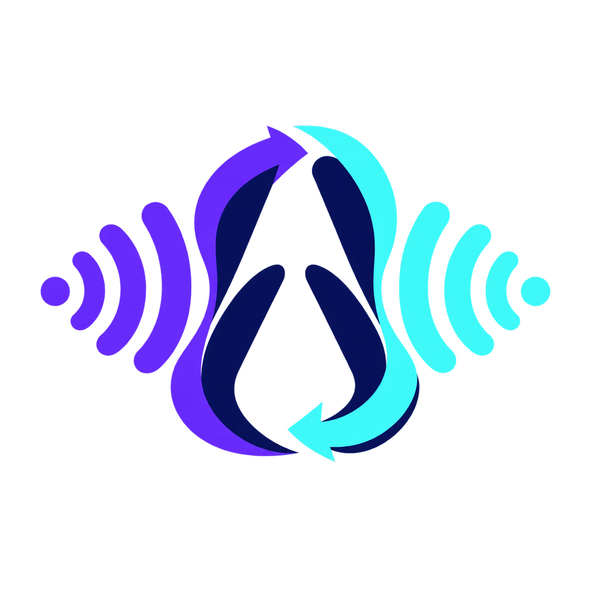
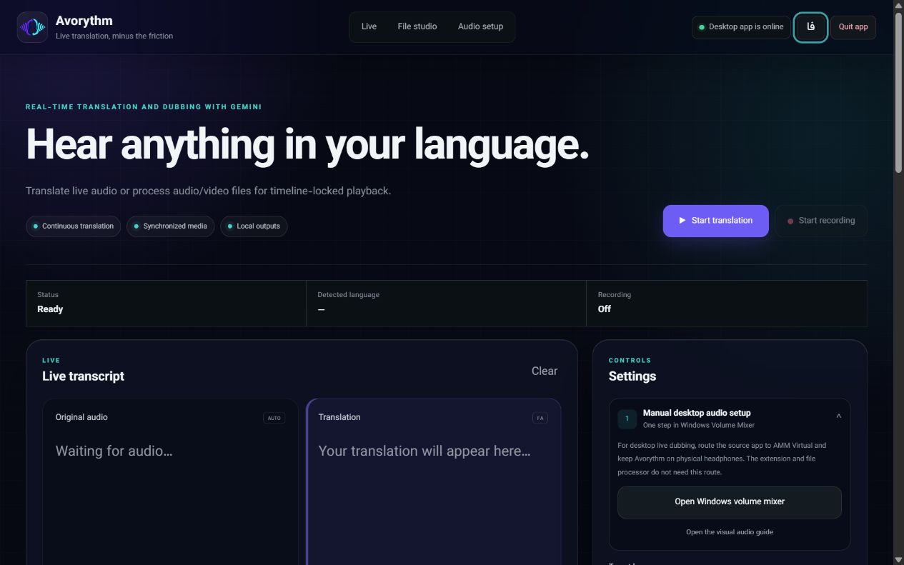
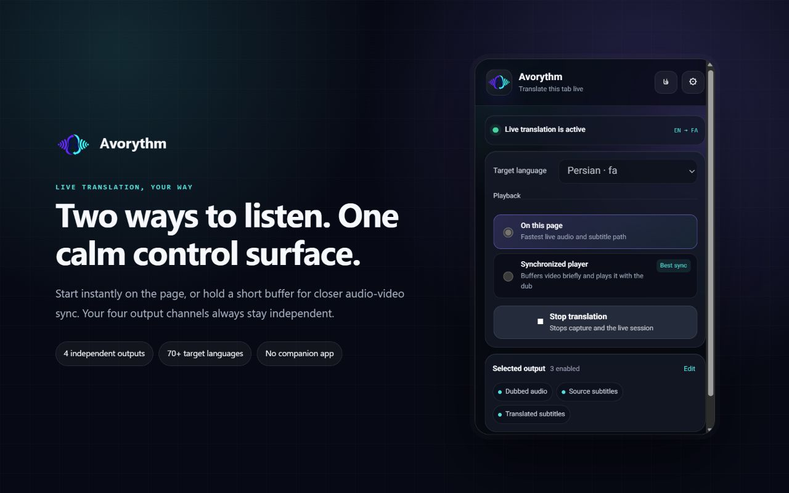

<p align="center">
  
</p>

<h1 align="center">Avorythm</h1>

<p align="center"><strong>Hear every voice—or just read it—in your language.</strong></p>

<p align="center">
  Live translation and dubbing for desktop and browser audio, plus synchronized processing
  for uploaded audio and video.
</p>

<p align="center">
  <a href="https://github.com/msmahdinejad/avorythm/actions/workflows/ci.yml"></a>
  <a href="https://github.com/msmahdinejad/avorythm/releases"></a>
  
  
  <a href="LICENSE"></a>
</p>

<p align="center">
  <a href="README.fa.md">فارسی</a> ·
  <a href="docs/HELP.md">User guide</a> ·
  <a href="docs/INSTALLATION.md">Installation</a> ·
  <a href="PRIVACY.md">Privacy</a> ·
  <a href="SUPPORT.md">Support</a> ·
  <a href="CONTRIBUTING.md">Contributing</a>
</p>



## Choose how you use Avorythm

| Use case | What you need | Virtual audio device |
|---|---|---|
| Translate a Chrome or Edge tab | Standalone extension | No |
| Process an audio or video file | Desktop app and FFmpeg | No |
| Translate VLC, a course player, or another desktop app live | Desktop app and a loopback/monitor input | Usually |

The desktop app and browser extension are independent. The extension does not require the app,
Python, FFmpeg, localhost, or a virtual audio cable.

## Features

- Live translated speech with source and translated captions.
- Four independent output channels: original audio, dubbed audio, source subtitles, and translated subtitles.
- Two extension playback paths: low-latency output on the current page, or a dedicated buffered player that keeps captured video, dub, and both caption tracks on one timeline.
- A movable, resizable frosted-glass subtitle card with adjustable size, width, and opacity.
- Optional recording of `original.wav`, `dubbed.wav`, `source.srt`, and `translated.srt`.
- Audio/video upload with timestamped transcription, translation, generated speech, and synchronized playback.
- A ZIP download containing all generated outputs.
- Persian and English interfaces with automatic RTL/LTR text direction.
- Native desktop windows for Windows, macOS, and Linux.



## Quick start

### Desktop app

Download the build for your operating system from [Releases](https://github.com/msmahdinejad/avorythm/releases).
Until SignPath approval is complete, Windows users install the clearly named
`Avorythm-Setup-x64-unsigned.exe`; macOS and Linux users can extract the matching ZIP. The Windows
build already contains FFmpeg for uploaded-media processing.

The app needs a Gemini API key. Media Studio additionally needs a Groq API key for Whisper.
Keys are stored in the operating-system keyring.

### Browser extension

For a manual installation from a GitHub release:

1. Extract `Avorythm-Extension.zip` into a permanent folder.
2. Open `chrome://extensions` or `edge://extensions`.
3. Enable **Developer mode**, select **Load unpacked**, and choose the extracted folder.
4. Pin Avorythm, complete the one-time setup on its separate Settings page, then start translation on a normal media tab.

Choose **On this page** for the lowest practical delay, or **Synchronized recorder & player** to keep
capture around 20 seconds ahead of an independently seekable player and place the generated dub on the same timeline. Protected
DRM media can block video capture; Avorythm reports the limitation and on-page mode remains available.
The synchronized player offers a fast Gemini 3.5 Live path and a precise Whisper → Gemini text pool → Gemini 3.1 Flash Live path. The precise path groups complete utterances, preserves Gemini's natural PCM without pitch-changing resampling, and schedules translated captions on the audible dub interval. Recording can be stopped manually, media transitions such as YouTube autoplay are finalized automatically, and an active/finalized session survives a player-page refresh.

On-page playback and synchronized playback/export have separate output controls. The synchronized player defaults to dubbed audio only; before export, users can independently enable original audio, dubbed audio, either subtitle file, set both audio levels, and apply smart ducking. Avorythm renders that selected audio mix into a new seekable WebM and downloads enabled subtitle tracks as SRT files.

Only the latest synchronized capture is retained temporarily in Chrome's private origin storage. Starting a new synchronized capture removes the previous local capture and its generated artifacts. Files explicitly downloaded by the user are saved under `Downloads/Avorythm` and are not removed automatically.

The extension key is kept only in `chrome.storage.session` and is cleared when the browser fully exits.

See the illustrated [complete user guide](docs/HELP.md) and the [installation and audio-routing guide](docs/INSTALLATION.md) for Windows AMM,
macOS loopback, Linux monitor sources, proxy setup, and troubleshooting.

## Data processing

- Live desktop and selected-tab audio is sent to Google Gemini only after the user starts translation.
- Uploaded media stays on the computer; extracted audio chunks go to Groq Whisper, while transcript text and generated speech requests go to Gemini.
- Preferences and generated files remain local. Avorythm has no analytics, advertising, or developer telemetry.
- Four-output recording is optional and disabled by default. Synchronized playback records the selected tab locally so it can seek and export a WebM.

Read the bilingual [privacy policy](PRIVACY.md) before processing private or copyrighted media.

## Development

Requirements: Python 3.12, Node.js 20+, and FFmpeg for Media Studio.

```powershell
python -m venv .venv
.\.venv\Scripts\Activate.ps1
python -m pip install -e ".[dev,build]"
python -m pytest -q
python -m ruff check src tests scripts
python -m mypy src
node --test tests/*.test.mjs
python -m avorythm
```

Build the current platform and package the extension:

```powershell
python scripts/build.py
.\scripts\package-extension.ps1
```

Contributor documentation: [architecture](ARCHITECTURE.md), [contributing guide](CONTRIBUTING.md),
[security policy](SECURITY.md), [support](SUPPORT.md), and [changelog](CHANGELOG.md).

## Release trust

Verify downloads against `SHA256SUMS.txt` from the same GitHub Release. The current Windows installer
is explicitly marked unsigned while the SignPath Foundation application is pending, so SmartScreen may
show an unrecognized-publisher warning. Signing and verification rules are documented in the
[code-signing policy](CODE_SIGNING_POLICY.md).

## Project status

Avorythm is under active development and uses preview AI services. Accuracy, voices, latency,
availability, and upstream quotas can change. Review important translations before relying on them.

## License

[MIT](LICENSE) © Mohammad Saleh Mahdinejad. The Windows package also contains FFmpeg under GPLv3;
see the [third-party notices](THIRD_PARTY_NOTICES.md).
