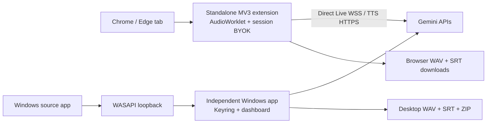

<div align="center">
  
  <h1>LingoDub</h1>
  <p><strong>Hear any browser tab or Windows app in your language — live.</strong></p>
  <p>
    <a href="README.md">English</a> · <a href="README.fa.md">فارسی</a>
  </p>
  <p>
    <a href="https://github.com/msmahdinejad/lingodub/actions/workflows/ci.yml"></a>
    <a href="https://github.com/msmahdinejad/lingodub/releases"></a>
    <a href="LICENSE"></a>
    
  </p>
</div>

LingoDub is an open-source Windows app and standalone Chromium extension for low-latency speech-to-speech translation. They are independent products: browser users install only the extension; desktop-player users install only the Windows app. Both use Google's `gemini-3.5-live-translate-preview`, support 70+ target languages, and export original/dubbed audio plus both subtitle tracks.


## Why LingoDub

- Browser audio without overlap: tab capture replaces direct playback, so **Dub only** really means only the dub.
- Three listening modes: dubbed only, original only, or a smart mix with automatic ducking.
- Desktop audio support through Windows WASAPI loopback and optional virtual routing.
- Live source and translated transcripts with automatic RTL/LTR direction.
- Native low-latency Gemini voice or 30 selectable Gemini TTS voices with style control.
- Four aligned exports: `original.wav`, `source.srt`, `dubbed.wav`, and `translated.srt`.
- Independent credentials: Windows Credential Manager for the app; browser-session-only BYOK for the extension.
- Persian and English dashboard and extension UI, using a locally bundled Vazirmatn font.
- No Node.js or frontend build step. Load the extension directly from its folder.

## Install

### Windows app — desktop players

Download `LingoDub-Setup-x64.exe` from the [latest release](https://github.com/msmahdinejad/lingodub/releases/latest), run it, then launch LingoDub. The dashboard opens at `http://127.0.0.1:8765`.

Portable users can download `LingoDub-Windows-x64.zip`, extract it, and run `LingoDub.exe`.

### Chrome or Edge extension — browser tabs

1. Download and extract `LingoDub-Extension.zip` from the latest release, or clone this repository.
2. Open `chrome://extensions` or `edge://extensions`.
3. Enable **Developer mode**, choose **Load unpacked**, and select the extracted `extension` folder.
4. Pin LingoDub, enter your Gemini API key in the popup, open a video tab, and click **Start dubbing this tab**.

The extension connects directly to Gemini. It needs no Windows app, localhost service, Virtual Cable, or Python installation. Its key is kept only for the current browser session and clears when Chrome/Edge fully exits.

If you cloned the repository, double-click [`install-extension.cmd`](install-extension.cmd). It copies the extension to a stable local folder, opens the extensions page, and puts that folder path on your clipboard. Browsers intentionally require the final **Load unpacked** click; an unpacked extension cannot bypass that security step.

> **Can installation be one click?** Yes, after LingoDub is reviewed and published in the Chrome Web Store (and separately in Microsoft Edge Add-ons). [Chrome on Windows blocks direct installation of locally hosted CRX files](https://developer.chrome.com/docs/extensions/how-to/distribute/install-extensions). Until a store listing exists, Developer mode + Load unpacked is the shortest supported public installation path.

See the [complete installation guide](docs/INSTALLATION.md) for independent API key, proxy, recording, and desktop-audio instructions.

## Quick use

1. Get a [Gemini API key](https://aistudio.google.com/app/apikey).
2. For a browser video, enter it in the extension popup. The extension uses the browser/system proxy and defaults to **Dub only**.
3. For VLC or another Windows app, save a separate key in the app dashboard, set the app proxy, and follow the **visual audio guide**.
4. Enable recording before Start to create the four outputs. The extension downloads four files; the app creates one convenience ZIP too.

## Audio routing: desktop app vs extension

| Usage | Virtual Cable | Required route |
| --- | --- | --- |
| Chrome/Edge **extension** | No | Leave the browser output unchanged; the extension captures and remixes the active tab itself. |
| VLC, desktop course player, or browser **without the extension** | Yes | Set that source application's output to the Virtual Cable. In LingoDub, capture the cable loopback and play the dub through physical headphones. |

For desktop mode, this distinction is mandatory:

```text
VLC / source app output → CABLE Input → LingoDub cable loopback capture
LingoDub listening output → physical headphones or speakers
```

Do not send LingoDub's output back into the same Virtual Cable; that creates feedback. Open the in-app guide at `http://127.0.0.1:8765/audio-guide.html` or read the [complete audio setup guide](docs/INSTALLATION.md).


## Architecture



The app and extension share no runtime process or localhost protocol. See [ARCHITECTURE.md](ARCHITECTURE.md).

## Develop

Requirements: Windows 10/11, Python 3.11–3.13, and a Gemini API key.

```powershell
py -3.12 -m venv .venv
.\.venv\Scripts\Activate.ps1
$env:HTTPS_PROXY = "http://127.0.0.1:10808" # if required
python -m pip install -e ".[dev,build]"
python -m lingodub
```

Quality gates:

```powershell
pytest -q
ruff check src tests scripts/*.py
mypy src
Get-ChildItem extension -Filter *.js | ForEach-Object { node --check $_.FullName }
```

Build a portable app and extension archive with `scripts/build.ps1` and `scripts/package-extension.ps1`.

## Security and privacy

The app binds only to `127.0.0.1` and stores its key in the OS keyring. The extension has no localhost access; it holds its user-provided key only in `chrome.storage.session` and connects directly to Google. Audio is sent only while dubbing is active, and recordings stay local. Review [SECURITY.md](SECURITY.md), [PRIVACY.md](PRIVACY.md), and Google's [Gemini API terms](https://ai.google.dev/gemini-api/terms).

## Current limitations

- Gemini Live Translate and Gemini TTS are preview services. Availability, latency, quotas, voice consistency, and translation accuracy cannot be guaranteed by this client.
- Browser capture requires Chrome/Edge 116 or newer and works only after a user clicks the extension action.
- The standalone extension follows the browser/system proxy; the app's `127.0.0.1:10808` proxy field does not configure Chrome.
- Google recommends ephemeral tokens backed by an authenticated server for production client-side Live API use. The current session-only BYOK mode is intended for user-owned keys; see the [store checklist](docs/CHROME_WEB_STORE.md) before public distribution.
- Desktop-app isolation currently needs a virtual audio endpoint. The browser extension does not.
- Per-app Windows routing is intentionally manual. LingoDub opens the correct Volume Mixer page but does not claim to change another application's output automatically.
- Source music/noise separation and speaker identity are controlled by the upstream model and may vary.
- Only audio you are authorized to process should be translated or recorded.

The implementation follows Google's current [Live Translate](https://ai.google.dev/gemini-api/docs/live-api/live-translate) and [speech generation](https://ai.google.dev/gemini-api/docs/speech-generation) documentation.

## Contributing

Issues and pull requests are welcome. Read [CONTRIBUTING.md](CONTRIBUTING.md), the [Code of Conduct](CODE_OF_CONDUCT.md), and the [roadmap](ROADMAP.md) first.

Licensed under the [MIT License](LICENSE). Vazirmatn is bundled under the SIL Open Font License; see [THIRD_PARTY_NOTICES.md](THIRD_PARTY_NOTICES.md).
