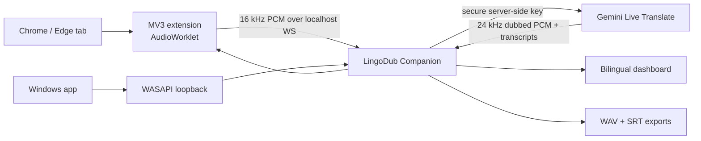

<div align="center">
  
  <h1>LingoDub</h1>
  <p><strong>Hear any browser tab or Windows app in your language — live.</strong></p>
  <p>
    <a href="README.md">English</a> · <a href="README.fa.md">فارسی</a>
  </p>
  <p>
    <a href="https://github.com/msmahdinejad/lingodub/actions/workflows/ci.yml"></a>
    <a href="https://github.com/msmahdinejad/lingodub/releases"></a>
    <a href="LICENSE"></a>
    
  </p>
</div>

LingoDub is an open-source Windows companion app and Chromium extension for low-latency speech-to-speech translation. It uses Google's `gemini-3.5-live-translate-preview`, supports 70+ target languages, renders bidirectional transcripts correctly, and can export the original audio, source subtitles, dubbed audio, and translated subtitles.


## Why LingoDub

- Browser audio without overlap: tab capture replaces direct playback, so **Dub only** really means only the dub.
- Three listening modes: dubbed only, original only, or a smart mix with automatic ducking.
- Desktop audio support through Windows WASAPI loopback and optional virtual routing.
- Live source and translated transcripts with automatic RTL/LTR direction.
- Native low-latency Gemini voice or 30 selectable Gemini TTS voices with style control.
- Four aligned exports: `original.wav`, `source.srt`, `dubbed.wav`, and `translated.srt`.
- API key stored in Windows Credential Manager; the extension never receives it.
- Persian and English dashboard and extension UI, using a locally bundled Vazirmatn font.
- No Node.js or frontend build step. Load the extension directly from its folder.

## Install

### Companion app

Download `LingoDub-Setup-x64.exe` from the [latest release](https://github.com/msmahdinejad/lingodub/releases/latest), run it, then launch LingoDub. The dashboard opens at `http://127.0.0.1:8765`.

Portable users can download `LingoDub-Windows-x64.zip`, extract it, and run `LingoDub.exe`.

### Chrome or Edge extension

1. Download and extract `LingoDub-Extension.zip` from the latest release, or clone this repository.
2. Open `chrome://extensions` or `edge://extensions`.
3. Enable **Developer mode**, choose **Load unpacked**, and select the extracted `extension` folder.
4. Pin LingoDub. Open a video tab and click **Start dubbing this tab**.

If you cloned the repository, double-click [`install-extension.cmd`](install-extension.cmd). It copies the extension to a stable local folder, opens the extensions page, and puts that folder path on your clipboard. Browsers intentionally require the final **Load unpacked** click; an unpacked extension cannot bypass that security step.

See the [complete installation guide](docs/INSTALLATION.md) for API key, proxy, and desktop-audio routing.

## Quick use

1. Open the dashboard and save a [Gemini API key](https://aistudio.google.com/app/apikey).
2. Keep the default proxy `http://127.0.0.1:10808`, or change it under Advanced settings.
3. For a browser video, use the extension. The default mode is **Dub only**.
4. For VLC or another Windows app, click **Automatic audio setup** in the dashboard and follow its Volume Mixer step.
5. Enable **Save four outputs** before starting, or use the dashboard recording control.

## Architecture



The core is deliberately split at hardware and cloud boundaries: `AudioEngine` owns WASAPI, `GeminiGateway` owns Google SDK details, `ExtensionBridge` owns the localhost protocol, and `DubRuntime` coordinates them. See [ARCHITECTURE.md](ARCHITECTURE.md).

## Develop

Requirements: Windows 10/11, Python 3.11–3.13, and a Gemini API key.

```powershell
py -3.12 -m venv .venv
.\.venv\Scripts\Activate.ps1
$env:HTTPS_PROXY = "http://127.0.0.1:10808" # if required
python -m pip install -e ".[dev,build]"
python -m lingodub
```

Quality gates:

```powershell
pytest -q
ruff check src tests scripts/*.py
mypy src
Get-ChildItem extension -Filter *.js | ForEach-Object { node --check $_.FullName }
```

Build a portable app and extension archive with `scripts/build.ps1` and `scripts/package-extension.ps1`.

## Security and privacy

The companion binds only to `127.0.0.1`. API keys are stored through the operating-system keyring and are never returned by the API or sent to the extension. Audio is streamed to Google only while dubbing is active. Recordings stay on your computer. Review [SECURITY.md](SECURITY.md) and Google's [Gemini API terms](https://ai.google.dev/gemini-api/terms).

## Current limitations

- Gemini Live Translate and Gemini TTS are preview services. Availability, latency, quotas, voice consistency, and translation accuracy cannot be guaranteed by this client.
- Browser capture requires Chrome/Edge 116 or newer and works only after a user clicks the extension action.
- Desktop-app isolation currently needs a virtual audio endpoint. The browser extension does not.
- Source music/noise separation and speaker identity are controlled by the upstream model and may vary.
- Only audio you are authorized to process should be translated or recorded.

The implementation follows Google's current [Live Translate](https://ai.google.dev/gemini-api/docs/live-api/live-translate) and [speech generation](https://ai.google.dev/gemini-api/docs/speech-generation) documentation.

## Contributing

Issues and pull requests are welcome. Read [CONTRIBUTING.md](CONTRIBUTING.md), the [Code of Conduct](CODE_OF_CONDUCT.md), and the [roadmap](ROADMAP.md) first.

Licensed under the [MIT License](LICENSE). Vazirmatn is bundled under the SIL Open Font License; see [THIRD_PARTY_NOTICES.md](THIRD_PARTY_NOTICES.md).
