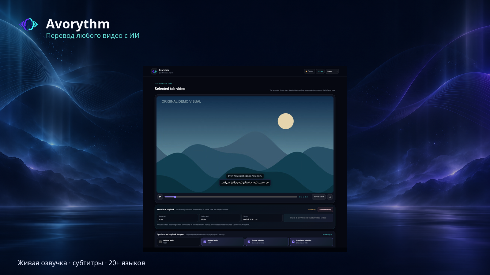

  

<h1 align="center">Avorythm</h1>

<strong>Слушайте любой голос — или читайте субтитры — на своём языке.</strong>

Перевод и озвучка звука в реальном времени, синхронизированные субтитры и обработка аудио- и видеофайлов.

  

  <a href="README.md">English</a> · <a href="README.fa.md">فارسی</a> · <a href="README.zh-CN.md">简体中文</a> ·
  <a href="docs/HELP.ru.md">Полное руководство</a> · <a href="PRIVACY.md">Конфиденциальность</a> ·
  <a href="SUPPORT.md">Поддержка</a> · <a href="CONTRIBUTING.md">Участие в разработке</a>

## Выберите подходящий вариант

| Задача | Что установить | Виртуальное аудиоустройство |
|---|---|---|
| Переводить вкладку Chrome или Edge | Расширение браузера | Не требуется |
| Обрабатывать аудио- и видеофайлы | Приложение для компьютера и FFmpeg | Не требуется |
| Переводить звук VLC или другой программы в реальном времени | Приложение и вход для захвата системного звука | Обычно требуется |

Приложение и расширение работают независимо. Расширению не нужны приложение, Python, FFmpeg, localhost или виртуальный аудиокабель.

## Возможности

- Озвученный перевод, исходные и переведённые субтитры в реальном времени.
- Четыре независимых канала: исходный звук, озвученный перевод и две дорожки субтитров. Выбирайте любое сочетание и настройте громкость.
- Перевод на исходной странице с малой задержкой или отдельный синхронизированный плеер с буфером, паузой, перемоткой и полным экраном.
- Карточка субтитров, которую можно перемещать и менять по размеру; настраиваются размер текста, ширина и непрозрачность фона.
- Необязательная запись `original.wav`, `dubbed.wav`, `source.srt` и `translated.srt`; в приложении доступен ZIP со всеми результатами.
- Обработка аудио- и видеофайлов с временными метками, переводом, озвучкой и синхронным воспроизведением.
- Экспорт записи расширения в WebM с выбранным балансом звука и отдельные файлы SRT для включённых дорожек субтитров.
- Приложение для Windows, macOS и Linux и русский интерфейс приложения и расширения.

Язык интерфейса задаёт язык кнопок и подсказок. Язык перевода выбирается отдельно: например, можно пользоваться русским интерфейсом и переводить английскую речь на японский. Исходный язык определяется автоматически. В списке языков перевода есть русский, английский, персидский, арабский, китайский, немецкий, французский, испанский, японский, корейский, турецкий и многие другие.

## Расширение: быстрый старт

1. [Установите Avorythm из Chrome Web Store](https://chromewebstore.google.com/detail/avorythm-live-translation/kbdbbedijheicmmnmoidamdaodjbhjje) и закрепите значок расширения.
2. Откройте настройки и добавьте собственный ключ Gemini из [Google AI Studio](https://aistudio.google.com/apikey).
3. В разделе конфиденциальности явно разрешите отправку звука выбранной вкладки в Google Gemini. Без ключа и согласия начать перевод нельзя.
4. Откройте обычную вкладку с видео или аудио, выберите язык перевода и нужные каналы, затем нажмите «Начать перевод».

Режим «На этой странице» даёт минимальную практически достижимую задержку. «Запись и синхронный плеер» записывает исходную вкладку с опережением; рекомендуемый запас — около 20 секунд. Отдельный плеер воспроизводит буфер, поэтому его можно ставить на паузу, перематывать и разворачивать на полный экран независимо от продолжающейся записи.

Быстрый движок использует Gemini 3.5 Live. Для точного режима добавьте ключ [Groq](https://console.groq.com/keys), разрешите браузеру доступ к `api.groq.com` и отдельно согласитесь на отправку коротких фрагментов звука в Groq Whisper. Whisper определяет временные метки реплик, пул текстовых моделей Gemini переводит их, а Gemini 3.1 Flash Live создаёт озвучку выбранным голосом.

Настройки вывода на странице и в синхронизированном плеере независимы. Перед экспортом выберите исходный звук, озвучку, их громкость, автоматическое приглушение оригинала и нужные субтитры. Создание итогового WebM обычно занимает примерно столько же времени, сколько длится запись: браузер воспроизводит её для сведения звука. В плеере отображаются ход обработки и оставшееся время.

В закрытом хранилище Chrome временно остаётся только последняя синхронизированная запись; новая запись заменяет предыдущую. Скачанные вручную файлы в `Downloads/Avorythm` автоматически не удаляются. Обычное сохранение четырёх файлов по умолчанию выключено; синхронизированный режим всё равно записывает вкладку на устройстве для перемотки и экспорта.

## Приложение для компьютера

[Скачайте сборку для своей системы](https://github.com/msmahdinejad/avorythm/releases). Сборка Windows включает FFmpeg; для macOS и Linux см. [инструкцию по установке](docs/INSTALLATION.md). Сверяйте загрузки с `SHA256SUMS.txt` из того же выпуска. Пока заявка SignPath не одобрена, установщик Windows имеет имя `Avorythm-Setup-x64-unsigned.exe` и может вызвать предупреждение SmartScreen.

В дополнительных настройках сохраните ключ Gemini; для обработки файлов также нужен ключ Groq. Приложение хранит ключи в защищённом системном хранилище. Для перевода файла откройте «Студию файлов», выберите файл, язык, голос и режим обработки. После завершения можно воспроизвести синхронизированный результат и скачать два WAV, два SRT или ZIP.

Для перевода звука других программ в реальном времени в Windows направьте звук исходной программы в AMM Virtual, а выход Avorythm — в физические наушники. В macOS используйте вход для захвата системного звука, например BlackHole; в Linux — источник мониторинга PipeWire/PulseAudio. Не направляйте озвучку обратно на вход захвата: это создаёт эхо. Расширению и обработке файлов такая настройка не нужна.

## Ключи, сеть и конфиденциальность

В расширении ключи по умолчанию хранятся только в текущем сеансе браузера и удаляются после его полного закрытия. Для каждого ключа можно отдельно включить «Запомнить ключ на этом устройстве». Такая копия остаётся в профиле браузера, не синхронизируется и не шифруется расширением; не используйте эту настройку на общих устройствах. Отключение опции удаляет копию с диска, а кнопка удаления ключа удаляет обе копии.

Если нужен прокси, настройка внутри приложения действует на его подключения. Расширение использует сеть самого браузера: настройте прокси браузера или системы, включая маршрут к `api.groq.com` для точного режима. Значение `127.0.0.1:10808` — пример локального прокси, а не обязательная настройка.

Прямые режимы Gemini отправляют звук в Google Gemini после начала перевода; расширение дополнительно требует явного согласия. В точном режиме расширения короткие фрагменты звука идут напрямую в Groq Whisper после отдельного согласия, затем текст — в Gemini для перевода и озвучки. При обработке файла сам файл остаётся на компьютере, но его аудиофрагменты отправляются в Groq, а текст и запросы озвучки — в Gemini.

У Avorythm нет рекламы, аналитики или промежуточного сервера разработчика. Обработка ИИ использует внешние сервисы; перед передачей частных или защищённых авторским правом материалов прочитайте [политику конфиденциальности](PRIVACY.md).

## Ограничения и участие в проекте

Бесплатные квоты Gemini и Groq ограничены и зависят от модели, аккаунта и региона; их условия и доступность могут меняться. Avorythm не обещает бесплатную неограниченную обработку. DRM-защита и внутренние страницы браузера могут блокировать захват. Перевод в реальном времени имеет задержку, а распознавание и перевод могут ошибаться — проверяйте важные материалы.

Подробные инструкции и помощь с неполадками: [полное руководство на русском](docs/HELP.ru.md) и [поддержка](SUPPORT.md). Нашли проблему или хотите улучшить перевод? См. [правила участия](CONTRIBUTING.md), [архитектуру](ARCHITECTURE.md), [политику безопасности](SECURITY.md) и [историю изменений](CHANGELOG.md).

[MIT](LICENSE) © Mohammad Saleh Mahdinejad. Сборка Windows также включает FFmpeg под GPLv3; см. [уведомления о сторонних компонентах](THIRD_PARTY_NOTICES.md).
