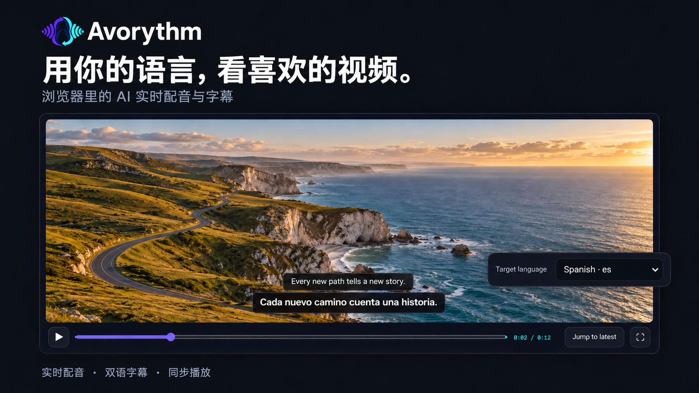

<h1 align="center">Avorythm</h1>

<strong>用自己的语言，听懂正在看的内容。</strong>

  

  <a href="README.md">English</a> · <a href="README.fa.md">فارسی</a> · <a href="README.ar.md">العربية</a> · <a href="README.de.md">Deutsch</a> · <a href="README.fr.md">Français</a> · <a href="README.it.md">Italiano</a> · <a href="README.ru.md">Русский</a> ·
  <a href="https://chromewebstore.google.com/detail/avorythm-live-translation/kbdbbedijheicmmnmoidamdaodjbhjje">安装 Chrome 扩展</a> ·
  <a href="docs/HELP.zh-CN.md">简体中文使用指南</a> · <a href="PRIVACY.md">隐私政策</a>

Avorythm 是开源的音频翻译与配音项目。浏览器扩展可以独立翻译所选 Chrome 或 Edge 标签页；桌面应用负责其他程序的声音及上传的音频、视频文件。**扩展不需要安装桌面应用。**扩展界面支持简体中文，桌面应用目前提供英文和波斯文界面。

## 浏览器扩展能做什么？

- 为所选标签页提供 AI 配音、原文字幕和译文字幕；四路输出可以单独开关。
- 选择低延迟的“在本页”模式，或使用可暂停、跳转、全屏及导出的同步播放器。
- 自定义原声与配音音量，移动和缩放字幕卡片。
- 可选保存两路 WAV 音频与两份 SRT 字幕；同步模式可按所选声音组合导出 WebM。

### 目标语言

桌面应用和浏览器扩展使用同一套目标语言目录。常用语言包括**英语、波斯语、阿拉伯语、简体中文、繁体中文、德语、法语、意大利语、西班牙语、俄语、日语、韩语、土耳其语、巴西和葡萄牙葡萄牙语、荷兰语、波兰语、乌克兰语、印地语、乌尔都语、希伯来语、印度尼西亚语、马来语、越南语和泰语**。选择器还包含孟加拉语、保加利亚语、捷克语、丹麦语、芬兰语、希腊语、匈牙利语、罗马尼亚语、瑞典语等更多语言。

安装后，在设置中填入自己的 Google AI Studio Gemini API 密钥，并明确授权向 Gemini 发送所选标签页的音频。密钥默认仅保留本次浏览器会话；Gemini 和 Groq 可分别开启“在此设备上记住密钥”。设备副本不会同步，也不由扩展加密。关闭此选项会删除设备副本并保留当前会话；清除密钥会删除两份副本。可选的精准同步模式还需要 Groq API 密钥及单独授权。服务的免费额度和模型可用性可能变化；实时翻译也无法保证零延迟或百分之百准确。

查看[图文使用指南](docs/HELP.zh-CN.md)了解两种播放方式、隐私、代理设置和常见问题。完整的开发与构建文档见[英文 README](README.md)。

[MIT 许可证](LICENSE) © Mohammad Saleh Mahdinejad。
