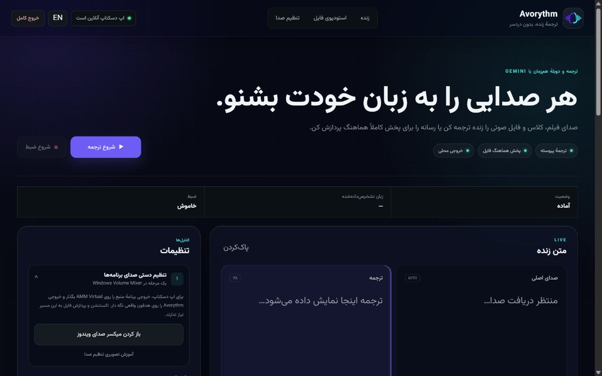
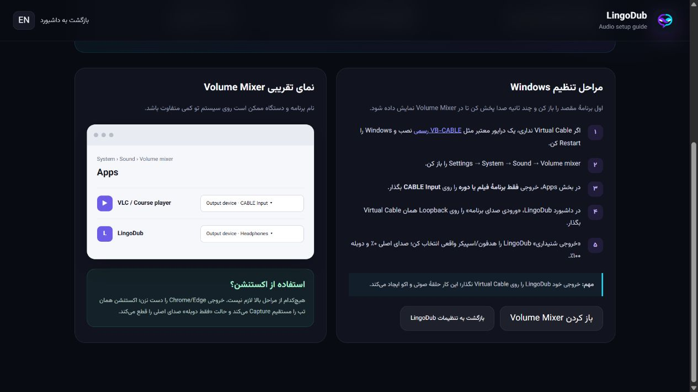
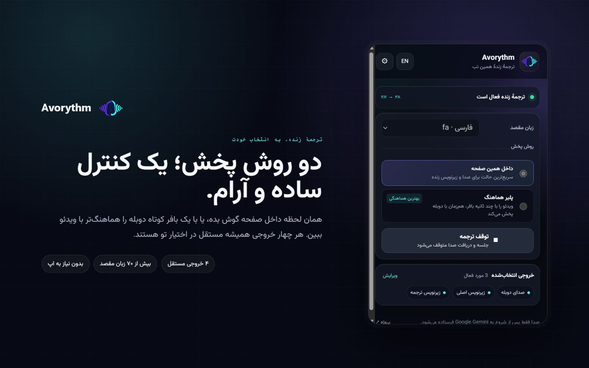
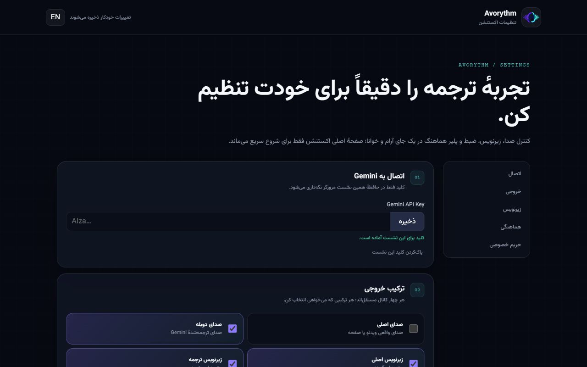
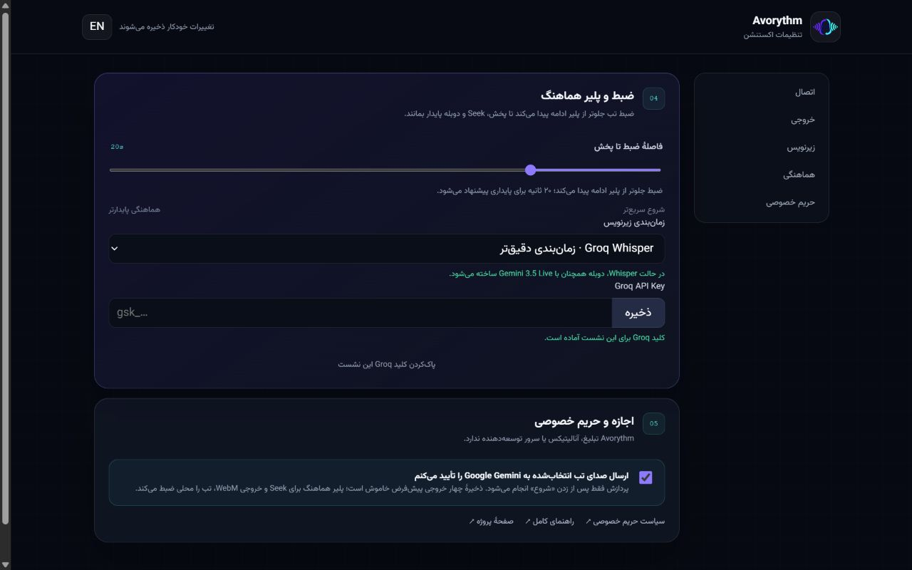
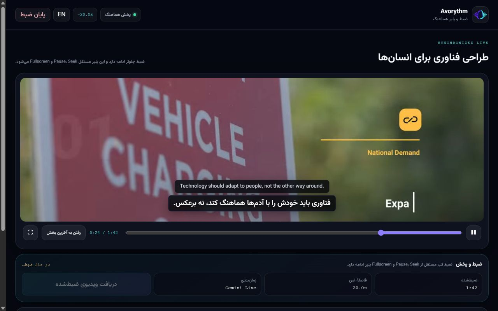
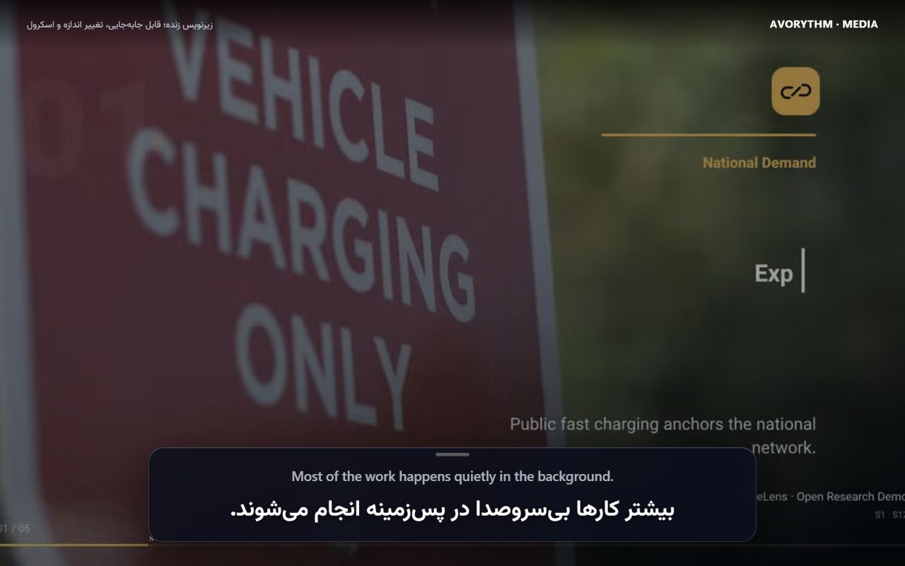

# راهنمای کامل Avorythm

[English guide](HELP.md) · [دانلود Avorythm](https://github.com/msmahdinejad/avorythm/releases) · [حریم خصوصی](../PRIVACY.md)

Avorythm دو محصول مستقل دارد. اپ دسکتاپ برای صدای برنامه‌های دیگر و فایل‌های صوتی/ویدئویی است. اکستنشن فقط تب انتخاب‌شده در Chrome یا Edge را ترجمه می‌کند و به اپ، FFmpeg، localhost یا صدای مجازی نیاز ندارد.

| می‌خواهم… | از این بخش استفاده کن | تنظیم صوتی اضافه |
|---|---|---|
| ویدیوی مرورگر را با کمترین تأخیر عملی ترجمه کنم | اکستنشن · داخل همین صفحه | لازم نیست |
| ویدیو را جلوتر ضبط کنم، عقب‌وجلو بروم، تمام‌صفحه ببینم و خروجی بگیرم | اکستنشن · ضبط و پلیر هماهنگ | لازم نیست |
| صدای VLC یا یک برنامهٔ دسکتاپ را زنده ترجمه کنم | اپ · ترجمهٔ زنده | ورودی Loopback/Monitor |
| از فایل صوتی یا ویدئویی چهار خروجی بگیرم | اپ · استودیوی فایل | لازم نیست |

## ۱. اپ دسکتاپ

### نصب و اتصال

1. نسخهٔ سیستم‌عاملت را از [Releases](https://github.com/msmahdinejad/avorythm/releases) بگیر. نصب‌کنندهٔ ویندوز FFmpeg را داخل خودش دارد.
2. Avorythm را اجرا کن. اپ در پنجرهٔ مستقل دسکتاپ باز می‌شود و لازم نیست Chrome باز بماند.
3. در **تنظیمات پیشرفته** کلید Gemini را وارد و ذخیره کن. برای استودیوی فایل به کلید Groq هم نیاز داری تا Whisper صدا را به متن تبدیل کند.
4. اگر اتصال مستقیم به Google نداری، پروکسی را روی `http://127.0.0.1:10808` بگذار. در حالت عادی این فیلد را خالی نگه دار.

کلیدها جدا از تنظیمات و در Keyring امن سیستم‌عامل ذخیره می‌شوند.

### ترجمهٔ زندهٔ صدای یک برنامهٔ دیگر

فقط این حالت به Loopback/Monitor نیاز دارد؛ فایل آپلودی و اکستنشن هیچ نیازی به آن ندارند.

در ویندوز و با AMM Virtual Audio Device:

1. در برنامهٔ منبع یک صدا پخش کن تا در **Settings → System → Sound → Volume mixer** دیده شود.
2. **Output device** برنامهٔ منبع را روی **Speakers (AMM Virtual Audio Device)** بگذار.
3. در Avorythm، **ورودی صدای برنامه** را روی **Microphone (AMM Virtual Audio Device) [Loopback]** تنظیم کن.
4. **خروجی شنیداری** Avorythm باید هدفون یا اسپیکر واقعی خودت باشد.
5. زبان مقصد و ترکیب خروجی را انتخاب کن و **شروع ترجمه** را بزن.

در macOS یک ورودی Loopback مانند BlackHole و در Linux ورودی Monitor مربوط به PipeWire/PulseAudio را انتخاب کن.

### خروجی را به سلیقهٔ خودت بساز

صدای اصلی، صدای دوبله، زیرنویس اصلی و زیرنویس ترجمه کاملاً مستقل‌اند؛ هر ترکیبی را می‌توانی فعال کنی. بلندی هر دو صدا جداست و کادر زیرنویس شناور را می‌توانی جابه‌جا یا Resize کنی و اندازهٔ متن، عرض، شفافیت و نمایش متن اصلی را تغییر بدهی.

### پردازش فایل صوتی یا ویدئویی

1. **استودیوی فایل** را باز کن و فایل را داخل آن رها کن.
2. زبان مقصد، گوینده و حالت **سینک دقیق** یا **سریع** را انتخاب کن.
3. پردازش را شروع کن و Avorythm را باز نگه دار. مراحل تبدیل صدا به متن، ترجمه، ساخت صدا و هماهنگ‌سازی نمایش داده می‌شوند.
4. پس از آماده‌شدن می‌توانی در پلیر داخلی ببینی یا این چهار فایل را بگیری:
   - `original.wav`
   - `dubbed.wav`
   - `source.srt`
   - `translated.srt`

فایل اصلی و خروجی‌ها روی سیستم خودت می‌مانند. فقط قطعه‌های صوتی برای Whisper به Groq، متن برای ترجمه به مجموعه‌مدل‌های Gemini و متن ترجمه‌شده برای ساخت صدا به Gemini Live می‌رود.

### رفع خطاهای رایج اپ

- **صدای زنده وارد نمی‌شود:** خروجی برنامهٔ منبع و ورودی Loopback اپ باید یک جفت AMM باشند. خروجی شنیداری Avorythm را دوباره وارد AMM نکن.
- **صدای اصلی و دوبله روی هم افتاده‌اند:** صدای اصلی را خاموش یا کم کن یا کاهش هوشمند صدا را روشن نگه دار.
- **فایل پردازش نمی‌شود:** از نصب‌کنندهٔ جدید ویندوز استفاده کن؛ FFmpeg همراه آن است. در نصب از سورس، باید فرمان FFmpeg روی `PATH` باشد.
- **Google وصل نمی‌شود:** کلید، سهمیه، زبان مقصد و پروکسی را بررسی کن. پروکسی داخل اپ فقط برای درخواست‌های API است.
- **بستن کامل اپ:** دکمهٔ **خروج کامل** بالای پنجره را بزن؛ بستن کادر زیرنویس یا یک تب، خود اپ را نمی‌بندد.

## ۲. اکستنشن مرورگر

### نصب

نسخهٔ منتشرشده را از Chrome Web Store نصب کن. برای نصب دستی هم می‌توانی `Avorythm-Extension.zip` را Extract کنی، به `chrome://extensions` بروی، **Developer mode** را روشن کنی، **Load unpacked** را بزنی و پوشهٔ Extractشده را انتخاب کنی. بهتر است Avorythm را Pin کنی.

### راه‌اندازی اول — این مرحله اجباری است

1. اکستنشن را باز کن و **بازکردن تنظیمات** را بزن.
2. کلید Gemini را ذخیره کن. این کلید فقط در حافظهٔ نشست Chrome می‌ماند و با خروج کامل از مرورگر پاک می‌شود.
3. در بخش **اجازه و حریم خصوصی** حتماً گزینهٔ **«ارسال صدای تب انتخاب‌شده به Google Gemini را تأیید می‌کنم»** را فعال کن. بدون این اجازه ترجمه شروع نمی‌شود.
4. زبان مقصد و کانال‌های خروجی دلخواهت را انتخاب کن.

### روش پخش را انتخاب کن

**داخل همین صفحه** کمترین تأخیر عملی را دارد. صفحهٔ اصلی جلوی چشمت می‌ماند، صدای اصلی در صورت فعال‌بودن برمی‌گردد، دوبله پخش می‌شود و کادر زیرنویس شناور روی صفحه دیده می‌شود. کمی تأخیر اجتناب‌ناپذیر است، چون صدا باید به Gemini برود و نتیجه برگردد.

**ضبط و پلیر هماهنگ** برای پایداری و هماهنگی بهتر طراحی شده است. یک مسیر تب را به‌صورت Producer ضبط می‌کند و پلیر مستقل پس از ساخته‌شدن فاصلهٔ امن—پیش‌فرض ۲۰ ثانیه—آن را مصرف می‌کند. Pause، Seek، جابه‌جایی بین تب‌ها یا Fullscreen خود پلیر، ضبط را متوقف نمی‌کند.

موتور سریع مستقیماً از Gemini 3.5 Live Translate استفاده می‌کند. برای زمان‌بندی دقیق‌تر، **Whisper + LLM + Gemini 3.1 Live** را انتخاب کن: Groq جمله‌های کامل و زمان آن‌ها را مشخص می‌کند، مخزن رایگان مدل‌های متنی Gemini با توجه به جمله‌های اطراف ترجمه را می‌سازد و Gemini 3.1 Flash Live متن را با گویندهٔ انتخابی می‌خواند. Avorythm صدای ساخته‌شده و هر دو زیرنویس را روی همان بازهٔ ضبط‌شده می‌نشاند. Chrome برای `api.groq.com` اجازه می‌خواهد و هر دو کلید فقط تا پایان نشست می‌مانند.

### کار با ضبط و پلیر هماهنگ

1. ویدیوی تب منبع را آماده کن، Avorythm را باز کن، **ضبط و پلیر هماهنگ** را انتخاب و Start را بزن.
2. صبر کن فاصلهٔ امن آماده شود؛ بعد پخش را شروع کن. ضبط در پس‌زمینه جلوتر ادامه دارد.
3. از Play/Pause، نوار Seek، **رفتن به آخرین بخش** و دکمهٔ Fullscreen خود پلیر استفاده کن. ویدیوی تب منبع را Fullscreen نکن؛ خود پلیر Avorythm را تمام‌صفحه کن.
4. اگر شبکه یا تولید دوبله موقتاً عقب افتاد، مصرف‌کننده مکث می‌کند، دوباره فاصلهٔ امن می‌سازد و بدون توقف مسیر ضبط ادامه می‌دهد.
5. با تمام‌شدن ویدیوی منبع، ضبط خودکار نهایی می‌شود. می‌توانی **پایان ضبط** را هم دستی بزنی. سپس دانلود WebM فعال می‌شود. اگر **ذخیرهٔ چهار خروجی** روشن بوده، دو WAV و دو SRT هم ذخیره می‌شوند.
6. Avorythm فقط آخرین ضبط هماهنگ را در فضای خصوصی و محلی Chrome نگه می‌دارد و با شروع ضبط بعدی، مورد قبلی جایگزین می‌شود. فایل‌هایی که خودت دریافت می‌کنی در `Downloads/Avorythm` باقی می‌مانند تا زمانی که آن‌ها را پاک کنی.

ویدیوی DRM و صفحه‌های داخلی Chrome قابل ضبط مستقیم نیستند. در این موارد از حالت **داخل همین صفحه** استفاده کن.

### زیرنویس روی هر صفحه

زیرنویس اصلی، ترجمه یا هر دو را روشن کن. کادر شیشه‌ای را بکش و به جای دیگری ببر، اندازه‌اش را عوض کن و برای متن بیشتر اسکرول کن. با تمام‌شدن هر جمله، خط زندهٔ قبلی جای خودش را به جملهٔ تازه می‌دهد و یک پاراگراف بی‌انتها ساخته نمی‌شود.

### رفع خطاهای رایج اکستنشن

- **Start غیرفعال است:** کلید Gemini را ذخیره و اجازهٔ اجباری را در Settings تأیید کن.
- **اتصال Gemini بسته شد:** کلید، سهمیه، تب دارای رسانه و بازنبودن صفحهٔ داخلی Chrome را بررسی کن. پس از وصل‌شدن دوبارهٔ پروکسی/VPN نشست را از نو شروع کن.
- **پلیر روی Buffering مانده:** ویدیوی منبع باید پخش باشد؛ برای بازسازی فاصلهٔ امن کمی صبر کن. اگر منبع یا شبکه مدام می‌ایستد، Recording lead را بیشتر کن.
- **فایل دانلود نشد:** هنگام درخواست، اجازهٔ اختیاری Downloads را بده. Avorythm تا تأیید درخواست دانلود، پیام ذخیره‌شدن نشان نمی‌دهد.
- **هشدار موتور دقیق:** کلید و سهمیهٔ Groq و دسترسی Gemini را بررسی کن. ضبط همچنان قابل پخش و توقف می‌ماند؛ اگر خروجی دقیق و کامل لازم داری، بعد از برطرف‌شدن اختلال جلسه را دوباره اجرا کن.
- **تصویر ضبط نمی‌شود:** DRM ممکن است ضبط ویدیوی تب را ببندد؛ حالت داخل همین صفحه را انتخاب کن.

## حریم خصوصی و استفادهٔ مسئولانه

پردازش فقط با اقدام مستقیم کاربر شروع می‌شود. Avorythm هیچ تبلیغ، Analytics، Telemetry توسعه‌دهنده یا سرور واسط برای محتوای کاربر ندارد. [سیاست حریم خصوصی دوزبانه](../PRIVACY.md) را بخوان و فقط محتوایی را پردازش یا ضبط کن که اجازه‌اش را داری.

