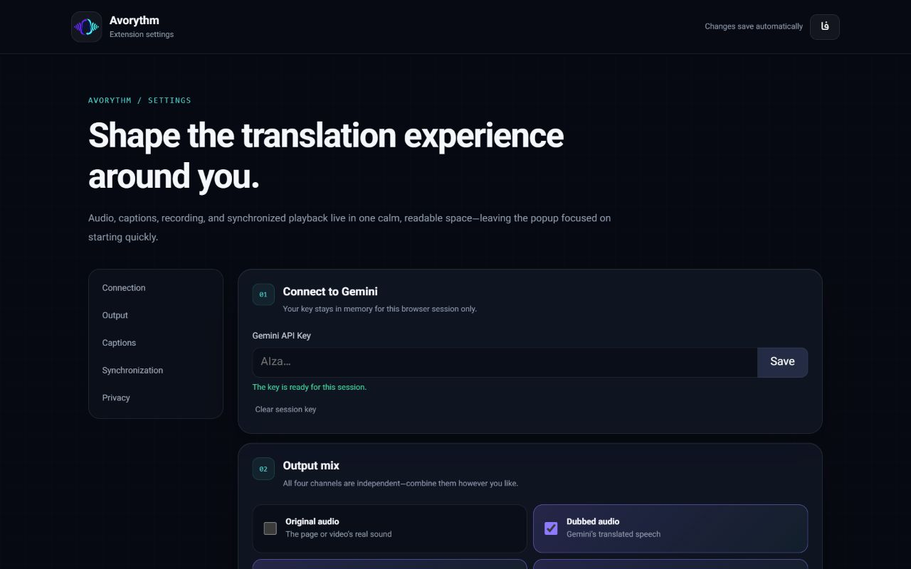
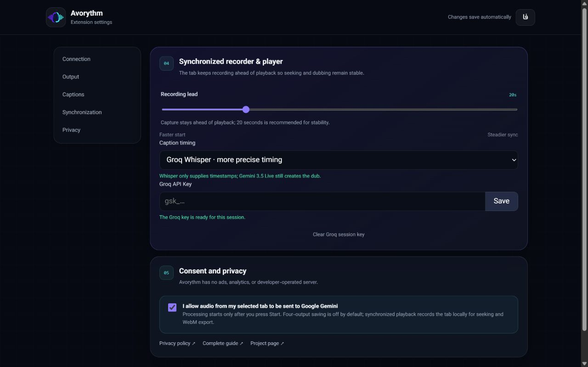
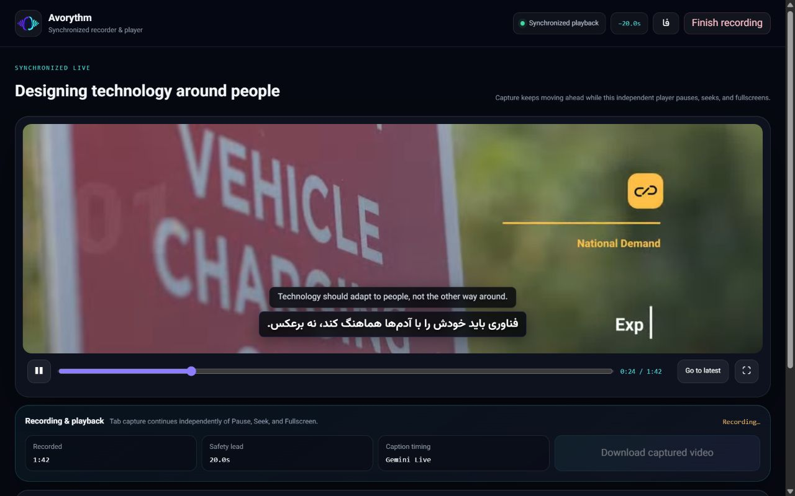
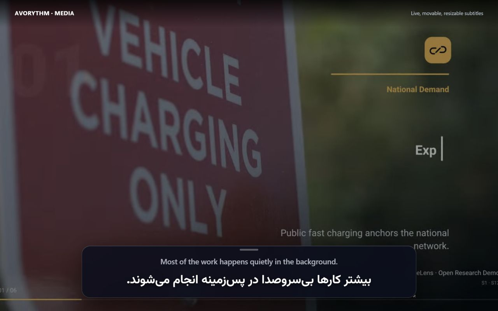

# Avorythm user guide

[راهنمای فارسی](HELP.fa.md) · [Download Avorythm](https://github.com/msmahdinejad/avorythm/releases) · [Privacy](../PRIVACY.md)

Avorythm has two independent products. The desktop app handles other desktop programs and uploaded files. The browser extension handles one selected Chrome or Edge tab and does not require the app, FFmpeg, localhost, or a virtual audio device.

| I want to… | Use | Extra audio setup |
|---|---|---|
| Translate a browser video with the lowest practical delay | Extension · On this page | None |
| Record ahead, seek, fullscreen, and export a synchronized browser video | Extension · Synchronized recorder & player | None |
| Translate VLC or another desktop program live | Desktop app · Live | Loopback/monitor input |
| Process an audio or video file into four outputs | Desktop app · File Studio | None |

## 1. Desktop app

### Install and connect

1. Download the build for your operating system from [Releases](https://github.com/msmahdinejad/avorythm/releases). The Windows installer already includes FFmpeg.
2. Launch Avorythm. It opens as a native desktop window; you do not need to keep Chrome open.
3. Open **Advanced settings**, enter a Gemini API key, and save it. File Studio additionally needs a Groq API key for Whisper transcription.
4. If Google is unavailable on your connection, set the proxy to `http://127.0.0.1:10808`. Leave it empty when you do not need a proxy.

The app stores both keys in the operating-system keyring, separately from preferences.

### Translate another desktop program live

Live desktop capture needs a loopback/monitor device. Uploaded files and the extension do not.

On Windows with AMM Virtual Audio Device:

1. Play audio once in the source program so it appears in **Settings → System → Sound → Volume mixer**.
2. Set the source program’s **Output device** to **Speakers (AMM Virtual Audio Device)**.
3. Set Avorythm’s **Application audio input** to **Microphone (AMM Virtual Audio Device) [Loopback]**.
4. Keep Avorythm’s **Listening output** on your real headphones or speakers.
5. Choose the target language and your output mix, then press **Start translation**.

On macOS, choose a loopback input such as BlackHole. On Linux, choose the appropriate PipeWire/PulseAudio monitor source.

### Choose your output

Original audio, dubbed audio, source subtitles, and translated subtitles are independent. You can enable any combination, set both audio levels, and open the floating subtitle window. The subtitle window can be moved and resized; its text size, width, opacity, and source line are adjustable.

### Process an uploaded audio or video file

1. Open **File Studio** and drop an audio or video file.
2. Select the target language, dubbing voice, and **Precise sync** or **Fast** processing.
3. Start processing and leave Avorythm running. The progress stages show transcription, translation, narration, and alignment.
4. When ready, use the built-in player or download:
   - `original.wav`
   - `dubbed.wav`
   - `source.srt`
   - `translated.srt`

File Studio keeps the source and generated outputs on your computer. It sends extracted audio chunks to Groq Whisper, transcript text to the Gemini translation pool, and translated text to Gemini Live for speech generation.

### Desktop troubleshooting

- **No live input:** verify the source program and Avorythm use the matching AMM output/loopback pair. Do not route Avorythm’s listening output back into AMM.
- **Original and dub overlap:** disable Original audio, lower it, or enable smart ducking.
- **Uploaded-media error:** use the current Windows installer, which bundles FFmpeg. On source installations, install FFmpeg and ensure the command is on `PATH`.
- **Google connection error:** verify the Gemini key, quota, target language, and proxy. The app proxy affects API traffic, not your entire system.
- **Close the app completely:** use **Quit app** in the top bar instead of only closing a browser tab or subtitle window.

## 2. Browser extension

### Install

Install the published extension from Chrome Web Store, or extract `Avorythm-Extension.zip`, open `chrome://extensions`, enable **Developer mode**, choose **Load unpacked**, and select the extracted folder. Pin Avorythm for quick access.

### First-time setup — required

1. Open Avorythm and select **Open settings**.
2. Save your Gemini API key. The key stays in Chrome session storage and is cleared after the browser fully exits.
3. In **Consent and privacy**, you must enable **“I allow audio from my selected tab to be sent to Google Gemini.”** Translation cannot start before this explicit consent.
4. Choose the target language and output channels.

### Choose a playback mode

**On this page** is the lowest-latency path. It keeps the original page visible, returns the captured original sound when enabled, plays the generated dub, and shows a movable subtitle card. A small live delay is unavoidable because audio must travel to and from Gemini.

**Synchronized recorder & player** prioritizes stable synchronization. Capture runs as a producer, while a separate player consumes the recorded stream after the configured safety lead—20 seconds by default. Pausing, seeking, switching tabs, or fullscreening the Avorythm player does not pause capture.

The faster engine uses Gemini 3.5 Live Translate directly. For tighter timing, select **Whisper + LLM + Gemini 3.1 Live**: Groq timestamps complete utterances, the free Gemini text-model pool translates them with batch context, and Gemini 3.1 Flash Live renders the selected voice. Avorythm fits that speech and both subtitle tracks to the same recorded interval. Chrome asks for access to `api.groq.com`; both API keys remain session-only.

### Use the synchronized recorder & player

1. Start the source video in a normal tab, open Avorythm, choose **Synchronized recorder & player**, and press Start.
2. Wait until the safety lead is ready, then start playback. Capture continues ahead independently.
3. Use Play/Pause, the seek bar, **Go to latest**, and the player’s fullscreen button. Fullscreen the Avorythm player—not the source video.
4. If network or generation briefly falls behind, the consumer pauses, rebuilds a safe lead, and resumes without stopping the producer.
5. When the source media ends, Avorythm finalizes the recording automatically. You can also press **Finish recording**. Then download the captured WebM. If **Save four outputs** was enabled, the two WAV and two SRT files are also saved.
6. Avorythm keeps only the latest synchronized capture in Chrome's private local storage. Starting another capture replaces it. Files you download remain under `Downloads/Avorythm` until you delete them.

The player cannot capture DRM-protected video or Chrome-internal pages. Use **On this page** when direct video capture is unavailable.

### Subtitles on any page

Enable Source subtitles, Translated subtitles, or both. Drag the glass subtitle card to another corner, resize it, and scroll longer content. Completed sentences replace the current live line instead of building one endless paragraph.

### Extension troubleshooting

- **Start is disabled:** save a Gemini key and complete the mandatory consent in Settings.
- **Gemini connection closed:** confirm the key, quota, selected media tab, and that the page is not a Chrome-internal page. Restart the session after reconnecting your proxy/VPN.
- **Player keeps buffering:** leave the source video playing; wait for the safety lead to rebuild. If the source or network repeatedly stalls, increase Recording lead in Settings.
- **No download:** grant the optional Downloads permission when prompted. Avorythm never claims files were saved until Chrome confirms the download request.
- **Precise-engine warning:** verify the Groq key/quota and Gemini availability. Capture remains usable and stoppable; retry the session after the service recovers if you need a complete precise dub.
- **No captured video:** DRM-protected playback may block tab video capture. Switch to On this page.

## Privacy and responsible use

Processing starts only after an explicit user action. Avorythm has no analytics, advertising, developer telemetry, or developer-operated content server. Read the [bilingual privacy policy](../PRIVACY.md), and process or record only media you are authorized to use.
