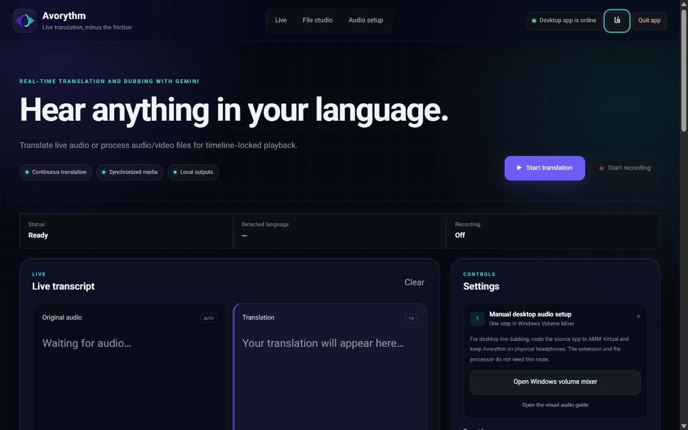
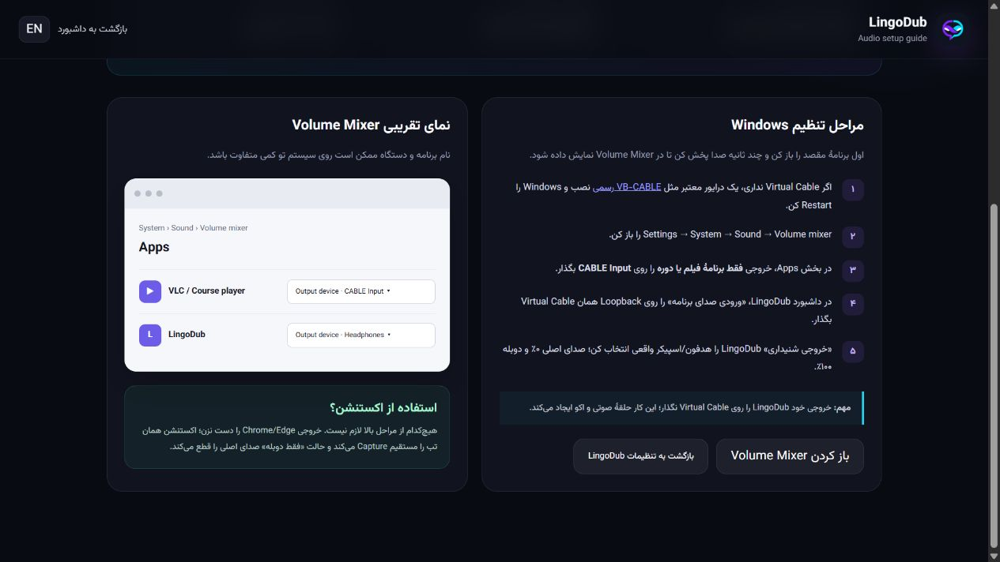
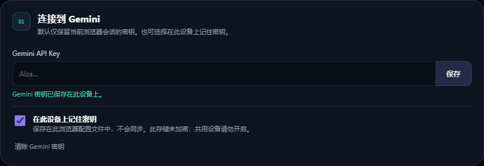
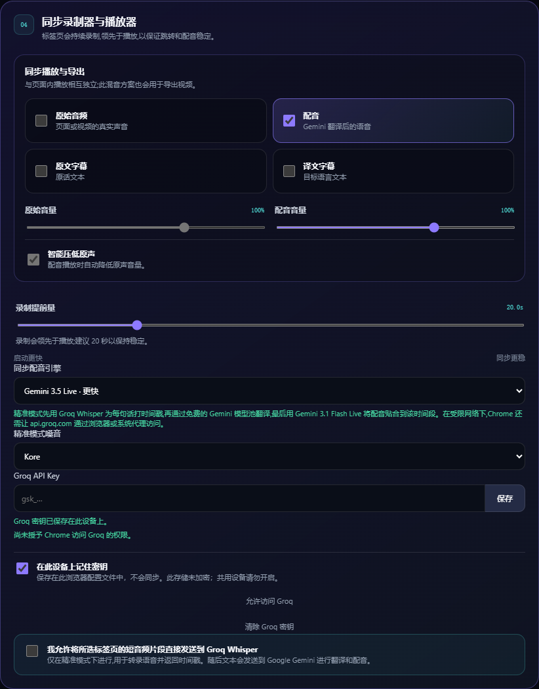

# Avorythm 使用指南

[English](HELP.md) · [فارسی](HELP.fa.md) · [安装扩展](https://chromewebstore.google.com/detail/avorythm-live-translation/kbdbbedijheicmmnmoidamdaodjbhjje) · [隐私政策](../PRIVACY.md)

Avorythm 有两个独立产品：浏览器扩展翻译所选 Chrome 或 Edge 标签页，不需要安装桌面应用、Python、FFmpeg 或虚拟声卡；桌面应用处理其他程序的声音及上传文件。扩展界面提供简体中文；桌面应用目前提供英文和波斯文界面。

## 1. 桌面应用

从 [Releases](https://github.com/msmahdinejad/avorythm/releases) 下载适合系统的安装包。Windows 安装包已包含 FFmpeg。启动后在高级设置中保存 Gemini API 密钥；处理上传文件还需要 Groq API 密钥。若当前网络无法直连 Google，可在应用内设置代理，例如 `http://127.0.0.1:10808`。这项设置只影响桌面应用的 API 请求，不改变 Chrome 的代理路由。密钥保存在操作系统的凭据库中。

### 翻译其他程序的实时声音

桌面实时翻译需要系统回环音频输入；上传文件与浏览器扩展均不需要。以下是 Windows 音频路由示例：

1. 让来源程序先播放声音，使它出现在 **设置 → 系统 → 声音 → 音量混合器** 中。
2. 将来源程序的输出设为 **Speakers (AMM Virtual Audio Device)**。
3. 将 Avorythm 的音频输入设为 **Microphone (AMM Virtual Audio Device) [Loopback]**，监听输出设为真实耳机或音箱。
4. 选择目标语言、原声／配音／字幕组合，然后点击 **Start translation**。不要把 Avorythm 的监听输出再次送入虚拟声卡，以免产生回声。

macOS 可以选择 BlackHole 一类的回环设备；Linux 可选择对应的 PipeWire／PulseAudio monitor 输入。

### 处理音频或视频文件

在 **File Studio** 上传文件，选择目标语言、配音声音及处理模式，等待转录、翻译、配音和对齐完成。随后可用内置播放器查看，或分别下载 `original.wav`、`dubbed.wav`、`source.srt`、`translated.srt`。文件保存在本机；提取的音频片段交给 Groq Whisper 转录，文本交给 Gemini 翻译，译文通过 Gemini Live 生成语音。

原声、配音、原文字幕和译文字幕可以独立开关；悬浮字幕窗口也能拖动、缩放和调整字号。若没有实时输入，先检查来源程序输出与 Avorythm 回环输入是否匹配。彻底退出应用请使用顶部的 **Quit app**。

## 2. 浏览器扩展

### 安装与首次设置

1. 从 [Chrome 网上应用店](https://chromewebstore.google.com/detail/avorythm-live-translation/kbdbbedijheicmmnmoidamdaodjbhjje) 安装并固定扩展图标。若使用 GitHub 发布包，请解压 `Avorythm-Extension.zip`，在 `chrome://extensions` 开启开发者模式，然后选择“加载已解压的扩展程序”。
2. 打开扩展，进入“设置”，填入自己的 Google AI Studio Gemini API 密钥。密钥默认仅保留当前浏览器会话，完全退出后会清除。Gemini 和 Groq 可分别开启“在此设备上记住密钥”；该副本仅保存在此浏览器配置文件中，不会同步，也不由扩展加密。共用设备请勿开启。关闭选项会删除设备副本并保留当前会话；清除密钥会删除两份副本。恢复默认设置也会删除设备副本。
3. 在“授权与隐私”中勾选“我允许将所选标签页的音频发送到 Google Gemini”。这是开始翻译前必须完成的步骤；音频只在你点击“开始翻译”后发送。
4. 选择目标语言以及播放方式。Google AI Studio 的免费额度和模型可用性可能变化；免费使用不等于无限量使用。

### 选择播放方式

“在本页”适合希望尽量降低延迟的情况。原页面保持可见，扩展播放配音并显示可移动的字幕卡片。语音需要经过网络处理，因此无法保证完全零延迟。

“同步录制器与播放器”会先录制所选标签页，再由独立播放器消费缓冲内容。默认录制提前量为 20 秒。播放器可以暂停、跳转和全屏；这些操作不会暂停前方的标签页录制。受 DRM 保护的视频和浏览器内部页面可能无法直接捕获，此时请使用“在本页”。

同步模式有两种引擎：

- **Gemini 3.5 Live**：较快的实时翻译路径，只需 Gemini 密钥及相应授权。
- **Whisper + LLM + Gemini 3.1 Live**：先由 Groq Whisper 为音频分段转录并提供时间戳，再用 Gemini 翻译与生成配音。此路径还需要 Groq 密钥、Chrome 对 `api.groq.com` 的访问权限，以及单独的 Groq 音频授权。网络受限时，请确认 Chrome 本身能够通过浏览器或系统代理访问该域名；桌面应用的私有代理设置不会改变 Chrome 的网络路由。

### 自定义声音、字幕与导出

原始音频、配音、原文字幕和译文字幕四项可以独立开关。两路音量可以分别调节，也可以启用智能压低原声。“在本页”与“同步播放与导出”使用两套独立的输出设置，修改一处不会改变另一处。

在同步播放器中，可以暂停、拖动进度条、跳到最新录制位置或全屏播放。媒体结束时录制会自动完成，也可以点击“结束录制”。导出前可调整四路输出的组合；“构建并下载定制视频”会按所选混音生成 WebM，并将启用的字幕另存为 SRT。浏览器需要回放本地录制来构建成品，因此导出耗时可能接近录制时长，页面会显示进度与预计剩余时间。

只有最近一次同步录制临时保存在 Chrome 的私有本地存储中，开始下一次录制会替换它。你主动下载的文件保存在 `Downloads/Avorythm`，不会被扩展自动删除。普通四文件保存默认关闭；启用后可得到 `original.wav`、`dubbed.wav`、`source.srt` 和 `translated.srt`。

### 只看字幕

如果希望继续听原声，可以关闭配音、保留原声，仅显示译文字幕。字幕卡片可以拖动、缩放、调整字号与透明度，并可滚动查看较长内容。

## 常见问题

- **“开始翻译”不可点击：**检查 Gemini 密钥和 Google 音频授权。精准模式还需 Groq 密钥、域名权限及单独的音频授权。
- **无法连接 Gemini 或 Groq：**检查密钥、模型配额，以及浏览器或系统代理。扩展不会自动修改 Chrome 的代理配置。
- **同步播放器持续缓冲：**确认源视频仍在播放；必要时在设置里增加录制提前量。
- **没有下载文件：**在 Chrome 提示时授予可选的 Downloads 权限。扩展不会在浏览器尚未确认下载时宣称文件已保存。
- **视频画面无法捕获：**DRM 或特定页面限制可能阻止标签页视频录制；改用“在本页”。

请在处理私人或受版权保护的媒体前阅读[隐私政策](../PRIVACY.md)，并在重要场景自行核对翻译结果。
